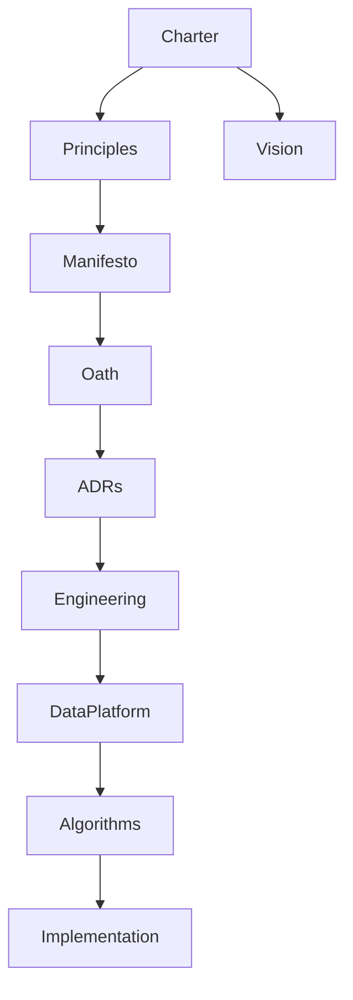

# Phoenix Traceability Matrix

| Source | Governs | Implemented Through |
|---|---|---|
| Phoenix Charter | Entire platform | Constitution, ADRs, engineering standards, product requirements |
| Founding Principles | Decision quality | Reviews, checklists, governance rules |
| Project Vision | Product direction | Roadmap, capabilities, product metrics |
| Engineering Manifesto | Engineering culture | Handbook, code reviews, architecture standards |
| Architecture Oath | Architecture decisions | ADRs, review checklists, system design |

## Core Trace

| Decision Constitution | Material decisions | ADRs, RFCs, scorecards |
| Quality Standard | All deliverables | quality gates, reviews, release checks |
| Governance Model | Roles and authority | approvals, escalation, ownership |
| Risk Governance | Risk handling | risk register, controls, contingency plans |
| Change Management | System changes | release, rollback, monitoring |
