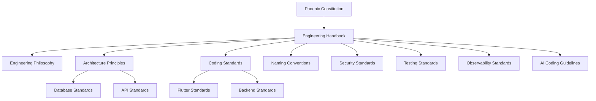

# PEH-000 — Phoenix Engineering Handbook

**Document ID:** PEH-000  
**Knowledge ID:** KN-ENG-000  
**Version:** 1.0  
**Status:** Approved Navigation Hub  
**Owner:** Chief Software Architect  
**Parent:** Phoenix Constitution v2.0  

## 1. Purpose

The Phoenix Engineering Handbook is the official navigation and governance hub for all engineering work. It aligns human engineers and AI coding agents around one set of decisions, vocabulary, standards, and quality expectations.

It does not replace specialized standards. It connects them.

## 2. Engineering Mission

Build a platform that remains:

- understandable;
- secure;
- testable;
- observable;
- maintainable;
- scalable;
- economically sustainable;
- adaptable to regional and product change.

## 3. Non-Negotiable Engineering Rules

1. Business logic belongs in domain or application layers, not controllers or UI widgets.
2. Bounded contexts may not directly modify one another's persistence.
3. Financial state is ledger-derived and auditable.
4. External providers are accessed through internal adapters.
5. Contracts are documented before broad consumption.
6. Critical operations define authorization, idempotency, timeout, retry, observability, and rollback.
7. Arabic RTL and English LTR are first-release requirements.
8. Security and privacy reviews are mandatory for high-risk features.
9. AI output is reviewed and tested like any other contribution.
10. Production complexity must be justified by operational evidence.

## 4. Engineering Knowledge Map

## 5. Engineering Lifecycle

Every significant change follows:

1. Problem definition
2. Scope and domain mapping
3. Requirements and acceptance criteria
4. Architecture review
5. Security and privacy review
6. Implementation plan
7. Development
8. Automated testing
9. Documentation
10. Staged deployment
11. Monitoring
12. Learning and iteration

## 6. Required Artifacts by Change Type

### Feature
- feature specification;
- acceptance criteria;
- analytics plan;
- security and abuse notes;
- test plan.

### Architecture Change
- ADR;
- dependency analysis;
- migration and rollback plan;
- cost and performance impact.

### Database Change
- migration;
- data ownership;
- retention and deletion policy;
- index review;
- rollback or compensating strategy.

### API Change
- versioned contract;
- authorization rules;
- error model;
- rate limits;
- compatibility plan.

### Financial Change
- ledger impact;
- idempotency design;
- reconciliation;
- fraud and refund handling;
- audit requirements.

## 7. Decision Hierarchy

When engineering goals conflict, use this order:

1. legal and safety obligations;
2. financial and data integrity;
3. constitutional compliance;
4. reliability;
5. user value;
6. maintainability;
7. performance;
8. delivery speed;
9. short-term convenience.

## 8. Release Quality Gates

No critical feature reaches production without:

- approved requirements;
- passing tests;
- authorization verification;
- secure logging;
- telemetry;
- rollback plan;
- operational owner;
- user-facing failure behavior.

## 9. AI Agent Entry Protocol

Before generating code, an AI agent must read:

- `AI_CONTEXT.md`;
- Phoenix Constitution;
- this handbook;
- relevant domain documentation;
- applicable ADRs;
- relevant standards;
- acceptance criteria.

The agent must state assumptions and must not invent critical financial, security, legal, or permission rules.

## 10. Success Criteria

The handbook succeeds when:

- two engineers independently reach compatible designs;
- AI agents produce structurally consistent output;
- onboarding time decreases;
- architecture drift is detectable;
- important decisions remain traceable;
- production incidents lead to documented improvement.
