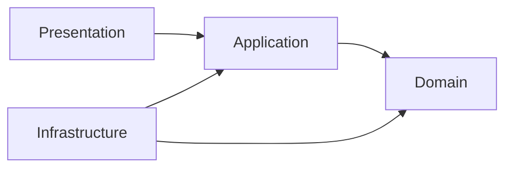

# PEH-002 — Architecture Principles

**Document ID:** PEH-002  
**Knowledge ID:** KN-ENG-002  
**Version:** 1.0  
**Status:** Approved  
**Related ADRs:** ADR-003, ADR-004  

## 1. Baseline Architecture

Phoenix begins as a modular monolith with strict bounded contexts, explicit interfaces, domain events, and provider abstractions.

Microservices are an evolution strategy, not a starting identity.

## 2. Mandatory Principles

### 2.1 Domain Ownership

Every entity, invariant, and business rule has one owning domain.

Other domains may reference stable identifiers or consume published contracts, but may not share mutable ownership.

### 2.2 Dependency Direction

Dependencies point inward:

Domain logic must not depend on frameworks, HTTP, databases, or SDKs.

### 2.3 Explicit Contracts

Cross-module communication uses:

- application interfaces;
- DTOs;
- versioned APIs;
- domain or integration events.

Shared ORM entities across domains are prohibited.

### 2.4 Provider Isolation

RTC, payments, payouts, email, SMS, storage, analytics, and AI providers must sit behind adapters.

### 2.5 Transaction Boundaries

Transactions should remain within one bounded context where practical.

Distributed workflows use durable state, events, idempotency, and reconciliation rather than pretending to be one database transaction.

### 2.6 Event Discipline

Events:

- describe completed facts;
- use past tense;
- are versioned;
- minimize sensitive data;
- support idempotent consumption.

### 2.7 Graceful Degradation

Failure of recommendations, analytics, decorative effects, or optional AI must not unnecessarily disable core communication.

### 2.8 Stateless Compute

Application nodes should remain stateless where practical. Durable state belongs in approved stores.

### 2.9 Security Boundaries

Authentication, authorization, data classification, and audit requirements are architectural concerns.

### 2.10 Multi-Region Readiness Without Premature Complexity

Design for regional growth, but do not deploy multi-region write architectures before consistency, compliance, and operational requirements justify them.

## 3. Service Extraction Criteria

A module becomes a service only when at least one condition is sustained and documented:

- independent scaling;
- independent availability;
- independent deployment;
- regulatory isolation;
- different data-residency needs;
- clear team ownership;
- persistent bottleneck.

## 4. Architecture Fitness Functions

Architecture health must be tested through automated or reviewable checks:

- forbidden dependency detection;
- contract compatibility;
- migration verification;
- authorization tests;
- latency budgets;
- dependency vulnerability scans;
- module ownership rules.

## 5. Architecture Review Checklist

- Is the owning domain explicit?
- Are dependencies directional and minimal?
- Is a new service truly necessary?
- Are failure modes documented?
- Is provider lock-in controlled?
- Are data and privacy boundaries defined?
- Are observability and rollback included?
- Is the cost at expected scale understood?
