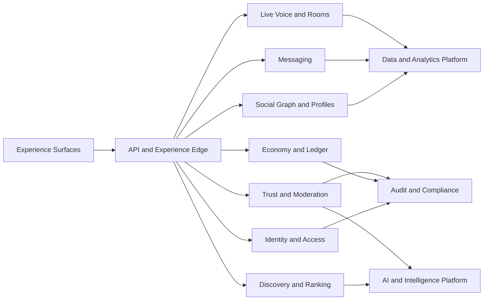

# ARC-001 — Architecture Vision

> **Document ID:** ARC-001
> **Knowledge ID:** PHX-ARCH-001
> **Category:** Architecture Foundation
> **Version:** 2.0.0
> **Status:** Ratified Foundation Specification
> **Maturity:** Level 2 — Specification
> **Owner:** Phoenix Architecture Council
> **Authority:** Phoenix Engineering Framework and Data Platform
> **Depends on:** PEF-001, PES-001, PES-002, DPL-010 through DPL-019
> **Review trigger:** Major domain change, deployment-model change, regulatory change, or material scale assumption change

## Executive Summary

Phoenix is an AI-native social platform ecosystem designed to support identity, social connection, messaging, live voice, creator participation, digital economy, trust, moderation, discovery, and future products without collapsing into a tightly coupled application. Its architecture must permit rapid product evolution while preserving correctness in high-risk domains.

The architectural strategy is **bounded-context modularity first, distributed extraction only when justified**. Phoenix will not begin as an uncontrolled microservice estate. It will preserve service-ready boundaries, explicit contracts, separate ownership, and observable interactions so that modules can be extracted when scale, risk, regulatory isolation, availability, or team autonomy require it.

## Design Goals

- Keep business invariants close to the context that owns them.
- Separate high-risk domains from high-change experience domains.
- Support global growth without prematurely optimizing every component for planetary scale.
- Make privacy, security, auditability, and operability architectural qualities, not later add-ons.
- Enable AI-driven experiences under policy, evaluation, and human-override controls.
- Support incremental migration from a modular foundation to selectively distributed services.
- Preserve architectural clarity through living documentation and decision records.

## Non-Goals

- Designing every future product in advance.
- Adopting microservices as a status symbol.
- Choosing one database or messaging technology for all workloads.
- Claiming exactly-once delivery or zero failure.
- Making AI the final authority for enforcement, eligibility, or financial truth.
- Building a global event-sourced architecture by default.

## Architectural Drivers

| Driver | Consequence |
|---|---|
| Social interactions change quickly | Product-facing modules need autonomy and replaceable internals |
| Identity and account security are high risk | Strong boundaries, audit, least privilege, and strict consistency |
| Messaging and live voice have real-time demands | Dedicated latency, ordering, fan-out, and capacity patterns |
| Digital economy carries financial risk | Isolated ledger truth, idempotency, reconciliation, and approval controls |
| Discovery and AI evolve experimentally | Versioned models, controlled rollout, feature contracts, and rollback |
| Global users create privacy and residency constraints | Region-aware processing and policy-controlled data placement |
| Abuse is adversarial | Trust signals, moderation, audit, and policy versioning are first-class |
| Growth is uncertain | Scale through evidence-based extraction rather than speculation |

## Architecture Style Decision Matrix

| Option | Strengths | Risks | Phoenix position |
|---|---|---|---|
| Layered monolith | Simple deployment and transactions | Hidden coupling, weak ownership | Rejected as sole organizing model |
| Modular monolith | Low operational overhead with explicit boundaries | Requires discipline to prevent erosion | **Preferred initial execution model** |
| Microservices | Independent scaling and deployment | Operational complexity, distributed failure | Selective future extraction |
| Event-driven architecture | Decoupling and asynchronous scale | Debugging, ordering, replay complexity | Used for governed integration, not everywhere |
| Event sourcing | Historical reconstruction | High modeling and operational cost | Only by explicit ADR for bounded use cases |
| Serverless-only | Rapid scaling for suitable workloads | Lock-in and workflow complexity | Tactical, not universal |

## Reference Architecture Principles

1. **Domain ownership over technical layering.** A context owns its model, policies, and authoritative data.
2. **Local consistency, explicit coordination.** Strong consistency remains local; cross-context workflows use sagas, compensation, and reconciliation.
3. **Contracts at every boundary.** APIs, events, files, analytics products, and AI features are versioned contracts.
4. **Risk-weighted isolation.** Identity, economy, trust, moderation, secrets, and audit receive tighter controls.
5. **Read models are disposable.** Search indexes, feeds, rankings, caches, and projections can be rebuilt from authoritative facts.
6. **Operations are part of design.** Every material component defines health, telemetry, ownership, failure behavior, and runbooks.
7. **Evolution is planned.** Every foundational decision includes migration and reversal considerations.
8. **AI is governed software.** Models, prompts, policies, evaluations, and human overrides are traceable.

## Target Quality Attributes

| Attribute | Foundation expectation |
|---|---|
| Correctness | Business invariants enforced by owning context |
| Availability | Tiered by capability; no universal target asserted yet |
| Scalability | Horizontal where workload justifies it; partition keys explicit |
| Security | Zero-trust principles, least privilege, secure defaults |
| Privacy | Classification, minimization, retention, deletion, residency controls |
| Auditability | Material actions attributable and reviewable |
| Observability | Correlation across commands, events, requests, jobs, and models |
| Maintainability | Replaceable modules and documented contracts |
| Resilience | Failure isolation, retries, idempotency, backpressure, reconciliation |
| Portability | Avoid unnecessary provider coupling in core domain truth |

## Initial Structural Model

This diagram shows logical responsibility, not a final deployment topology.

## Evolution Strategy

### Phase A — Foundation

- Modular boundaries in one or a small number of deployable units.
- One authoritative transactional database platform with strict schema ownership where practical.
- Asynchronous integration through transactional outbox and idempotent consumers.
- Separate runtime only for workloads with clear technical need, such as media, real-time voice, search, or model serving.

### Phase B — Selective Extraction

A context may become an independently deployed service when one or more are true:

- Its availability target differs materially from the rest of the platform.
- Its scale curve is independently dominant.
- It requires regulatory, regional, or security isolation.
- Its release cadence or team ownership needs independence.
- Its technology requirements cannot be met responsibly inside the current unit.
- Coupling costs are lower than the operational cost of extraction.

### Phase C — Global Platform

- Region-aware routing and placement.
- Policy-driven replication and residency.
- Multi-region failure strategies per capability.
- Dedicated platform services for identity, events, data, AI, trust, and developer enablement.

## Security Considerations

- Authentication, authorization, consent, and policy decisions are explicit services or modules with versioned rules.
- Privileged actions require stronger authentication, durable audit, and separation of duties where appropriate.
- Secrets and cryptographic material never travel through ordinary domain events.
- Service identity and workload authorization are distinct from end-user identity.
- Data classification controls storage, logging, analytics, model use, and export.

## AI Context

AI can support ranking, translation, safety classification, recommendations, assistance, summarization, and operations. Every AI capability must define:

- purpose and prohibited use;
- input and output classification;
- model and prompt version;
- evaluation criteria;
- human override and appeal path when decisions affect users materially;
- fallback behavior;
- monitoring for quality, bias, drift, abuse, and cost.

## Operational Considerations

Every deployable unit must publish owner, service tier, dependencies, health signals, error budget, rollback mechanism, data recovery approach, and incident escalation. Architecture documentation that omits operational ownership is incomplete.

## Anti-Patterns

- Shared database tables used as integration APIs.
- Circular synchronous dependencies between domains.
- A central “god service” owning unrelated policy and data.
- Premature service extraction without ownership or observability.
- Silent retries of non-idempotent operations.
- Feature teams bypassing trust, privacy, or audit controls.
- Model outputs directly mutating authoritative financial or enforcement state.

## Engineering Rules

- Every new capability maps to one owning context.
- Cross-context write workflows require an explicit consistency model.
- Every external dependency has timeout, retry, fallback, and ownership rules.
- Every event has a stable name, version, owner, classification, and retention rule.
- Every high-risk workflow includes audit and reconciliation.
- Every architectural exception is recorded in an ADR.

## Future Evolution

Release 2 will define communication patterns, deployment philosophy, scalability strategy, failure isolation, and a reference architecture. Subsequent domain releases will refine internal models and service-level targets.

## Architectural Integrity Check

- [x] Defines architecture style and evolution path.
- [x] Separates logical architecture from deployment topology.
- [x] Includes security, privacy, AI, failure, and operations.
- [x] Avoids unjustified microservices and exactly-once claims.
- [x] Aligns with Data Platform ownership and contract rules.
- [ ] Requires validation against concrete product journeys in later releases.

## References

- Phoenix Engineering Principles (PEF-001)
- Phoenix Architecture Standard (PES-002)
- Phoenix Data Philosophy and Ownership (DPL-010, DPL-012)
- Phoenix Data Consistency and Event Modeling (DPL-015, DPL-019)
