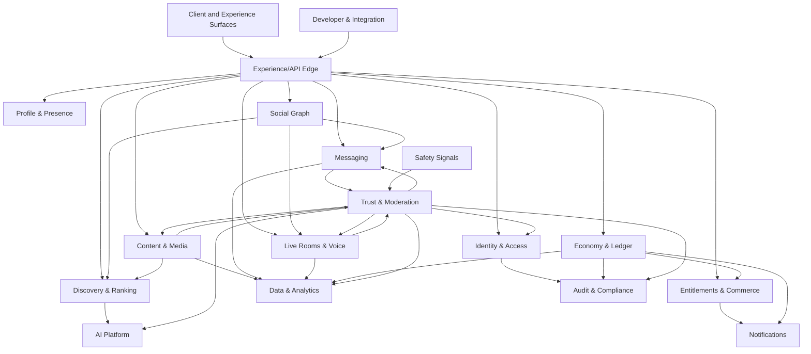

# ARC-003 — Domain Map

> **Document ID:** ARC-003
> **Knowledge ID:** PHX-ARCH-003
> **Category:** Architecture Foundation
> **Version:** 2.0.0
> **Status:** Ratified Foundation Specification
> **Maturity:** Level 2 — Specification
> **Owner:** Phoenix Architecture Council
> **Authority:** Phoenix Engineering Framework and Data Platform
> **Depends on:** PEF-001, PES-001, PES-002, DPL-010 through DPL-019
> **Review trigger:** Major domain change, deployment-model change, regulatory change, or material scale assumption change

## Executive Summary

The Phoenix Domain Map describes how bounded contexts cooperate to deliver end-to-end outcomes. It identifies upstream and downstream relationships, synchronous decision paths, asynchronous propagation, and critical coordination points. It is a logical map, not a network diagram.

## Domain Layers

### Experience Domains

- Profile & Presence
- Social Graph
- Messaging
- Live Rooms & Voice
- Content & Media
- Notifications

### Trust and Value Domains

- Identity & Access
- Trust & Moderation
- Safety Signals
- Economy & Ledger
- Entitlements & Commerce
- Audit & Compliance

### Intelligence and Platform Domains

- Discovery & Ranking
- AI Platform
- Data & Analytics
- Developer & Integration
- Administration

## High-Level Domain Map

Arrows represent dependency or governed interaction, not permission for direct database access.

## Critical User Journeys

### Journey 1 — Registration and Safe Onboarding

1. Experience Edge submits registration command to Identity & Access.
2. Identity validates credentials, risk signals, and policy.
3. Account creation commits locally and emits `AccountRegistered`.
4. Profile creates default presentation state idempotently.
5. Notifications sends verification or onboarding communication.
6. Audit records material security events.
7. Discovery excludes incomplete or restricted accounts until eligibility is confirmed.

**Failure rule:** Identity success is not rolled back because a profile projection failed. Reconciliation repairs downstream initialization.

### Journey 2 — Send a Direct Message

1. Client authenticates through Identity and submits to Messaging.
2. Messaging checks membership and consults current block/enforcement decisions through fast local projections or authoritative policy APIs.
3. Message commits with a conversation sequence.
4. Delivery fan-out and notifications occur asynchronously.
5. Safety Signals may analyze metadata/content under policy.
6. Trust can apply enforcement through governed commands.

**Consistency rule:** message acceptance and conversation order are owned by Messaging; notification and analytics are eventual.

### Journey 3 — Join and Participate in a Live Room

1. Live Rooms validates room state and user eligibility.
2. Identity provides authentication state; Social Graph and Trust provide relevant eligibility projections.
3. Live control plane grants participant role and media credentials.
4. Media plane carries audio separately from domain control state.
5. Moderation actions are auditable and propagated with low latency.

**Failure rule:** degraded discovery or analytics must not terminate an active room. Trust and identity controls remain fail-safe according to policy.

### Journey 4 — Send a Gift

1. Live experience requests a gift transfer.
2. Economy verifies idempotency key, balance, limits, sanctions, and ledger rules.
3. Ledger entries commit atomically.
4. Economy emits `GiftTransferCompleted` or a failure result.
5. Live displays the effect, Notifications informs recipients, Analytics records a derived fact.

**Consistency rule:** visual effects never constitute financial truth. Economy is authoritative.

### Journey 5 — Report and Appeal Abuse

1. User submits report to Trust & Moderation.
2. Trust captures evidence references and policy version.
3. Safety Signals and AI Platform may provide recommendations.
4. Trust records a human or policy-authorized decision.
5. Enforcement propagates to relevant domains.
6. Appeal is a new controlled workflow linked to the original decision.
7. Audit records material actions and access.

**Decision rule:** AI recommendations do not silently become irreversible policy authority.

## Upstream/Downstream Relationship Matrix

| Upstream | Downstream | Relationship | Contract |
|---|---|---|---|
| Identity | All user-facing contexts | Stable account reference and security state | API + events |
| Social Graph | Messaging, Live, Discovery | Relationship and block eligibility | Decision API + projections |
| Content | Discovery | Publish/update/delete lifecycle | Events |
| Trust | Experience contexts | Enforcement and eligibility | API + priority events |
| Economy | Live, Commerce, Notifications | Transfer and settlement outcomes | Command/result + events |
| Commerce | Experience | Entitlement state | API/read model + events |
| AI Platform | Discovery, Trust, Support | Governed inference | Versioned inference contract |
| Domain contexts | Data & Analytics | Governed analytical facts | Events/data contracts |
| Restricted contexts | Audit | Material action records | Append API/stream |

## Communication Categories

### Synchronous Decision Calls

Use when the caller cannot proceed safely without an immediate authoritative decision, such as authentication, balance authorization, entitlement check, or high-risk policy decision. Calls require strict timeouts and fallback semantics.

### Asynchronous Fact Propagation

Use after a fact has committed and downstream work may happen independently: indexing, analytics, notifications, projections, model features, and many workflow steps.

### Workflow Coordination

Use saga-style coordination for multi-context business processes. Orchestration is appropriate when one owner must track progression; choreography is appropriate for loosely coupled propagation. Compensation is business-specific and never assumed to reverse every effect.

## Dependency Rules

- No circular mandatory synchronous dependency is allowed.
- Critical request paths minimize remote hops.
- A downstream consumer cannot force the upstream owner to expose internal storage models.
- Derived systems tolerate replay and duplicate events.
- Emergency controls have explicit priority and propagation behavior.

## Data Movement Rules

- References use global opaque identifiers.
- Copies are purpose-limited and classified.
- Sensitive payloads are minimized in integration events.
- Deletion and restriction signals propagate to copies and projections.
- Analytics and AI use approved data contracts, not production table scraping.

## Failure and Degradation Map

| Failure | Expected behavior |
|---|---|
| Discovery unavailable | Core profile, messaging, direct navigation remain available where possible |
| Notifications unavailable | Domain action succeeds; delivery queues retry with limits |
| Analytics unavailable | Product transactions continue; events buffer or degrade safely |
| AI inference unavailable | Deterministic fallback or human review according to capability |
| Economy unavailable | No fake balance or optimistic financial success |
| Trust policy service degraded | Apply defined fail-safe/fail-limited policy by action risk |
| Media processing degraded | Text and metadata workflows may continue independently |
| Audit write unavailable for critical action | Action follows documented fail-closed or protected buffer policy |

## Security Considerations

Domain interactions use authenticated workload identity, least-privilege scopes, and policy-aware authorization. Sensitive contexts do not trust the experience edge merely because a user session was validated.

## AI Context

AI interactions are represented as governed requests and evidence. Domain owners define how outputs influence decisions. AI Platform owns model operation; domain contexts own outcome policy.

## Operational Considerations

Correlation IDs, causation IDs, actor context, and trace context follow requests and events. Domain maps must be reflected in service catalogs and incident ownership.

## Anti-Patterns

- Treating the event bus as an ungoverned shared database.
- Long synchronous chains across many contexts.
- Cross-domain transactions pretending network failure cannot happen.
- Using analytics or search as source of truth.
- Duplicating identity or ledger truth in experience modules.

## Future Evolution

The map will be validated against product journeys, then refined with communication patterns and deployment topology in Release 2. Context splits and mergers require ADRs and migration plans.

## Architectural Integrity Check

- [x] Maps user journeys to owners.
- [x] Identifies synchronous and asynchronous interaction classes.
- [x] Defines degradation behavior for major platform failures.
- [x] Preserves data ownership boundaries.
- [ ] Latency and availability targets remain to be quantified.

## References

- ARC-001 Architecture Vision
- ARC-002 Bounded Contexts
- DPL-015 Data Consistency Model
- DPL-018 Data Contracts
- DPL-019 Event Modeling
