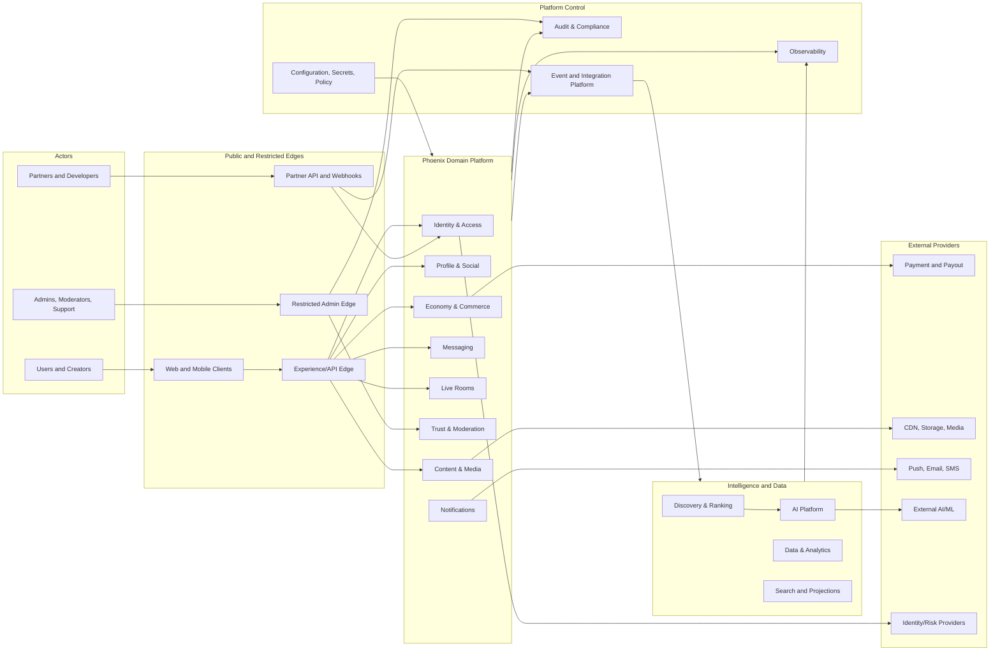

# ARC-005 — System Landscape

> **Document ID:** ARC-005
> **Knowledge ID:** PHX-ARCH-005
> **Category:** Architecture Foundation
> **Version:** 2.0.0
> **Status:** Ratified Foundation Specification
> **Maturity:** Level 2 — Specification
> **Owner:** Phoenix Architecture Council
> **Authority:** Phoenix Engineering Framework and Data Platform
> **Depends on:** PEF-001, PES-001, PES-002, DPL-010 through DPL-019
> **Review trigger:** Major domain change, deployment-model change, regulatory change, or material scale assumption change

## Executive Summary

The System Landscape identifies the major actors, external systems, logical platform zones, trust boundaries, and data flows surrounding Phoenix. It provides enough structure to guide detailed architecture without pretending that final deployment choices are already made.

## Actors

- End users
- Creators and hosts
- Moderators and trust operators
- Support and operations staff
- Finance and compliance staff
- External developers and approved partners
- Internal product and engineering teams
- Regulators or lawful authorities through controlled processes

## External Systems

- Identity verification or authentication providers where approved
- App stores and payment processors
- Banking or payout providers
- Push, email, and SMS providers
- CDN, object storage, and media-processing services
- Speech, translation, and AI model providers
- Fraud, abuse, or reputation vendors
- Analytics and observability platforms
- Legal and compliance export destinations under controlled process

## Logical Landscape

This landscape is logical. Boxes may share or separate deployment units according to later decisions.

## Trust Zones

### Zone 1 — Untrusted Client Zone

Mobile, web, and partner clients are never trusted to enforce authorization, pricing, balances, moderation, or eligibility. Inputs are validated and rate-limited.

### Zone 2 — Public Edge

Terminates external traffic, authenticates requests, applies coarse protections, routes to domain capabilities, and produces trace context. It does not become the owner of domain policy.

### Zone 3 — Restricted Administrative Edge

Separate access path for operators with stronger authentication, device posture, network controls where appropriate, approval workflows, and comprehensive audit.

### Zone 4 — Domain Processing Zone

Hosts authoritative business logic and local transactional state. Access is workload-authenticated and least privilege.

### Zone 5 — Data and Intelligence Zone

Hosts analytical processing, search, model operations, and derived data. It receives governed contracts and cannot mutate domain truth directly.

### Zone 6 — Security, Audit, and Control Zone

Contains secrets, policy configuration, audit, compliance evidence, and control-plane capabilities. Access is highly restricted.

### Zone 7 — External Provider Zone

All provider interactions are considered unreliable and potentially inconsistent. Phoenix uses anti-corruption layers, signatures, idempotency, timeout, retry, reconciliation, and provider-specific adapters.

## Primary Runtime Building Blocks

| Building block | Responsibility | Initial posture |
|---|---|---|
| Client applications | User experience and local state | Untrusted; no authoritative policy |
| Experience/API Edge | Request routing, coarse auth, aggregation | Stateless where practical |
| Domain modules/services | Business invariants and authoritative state | Modular boundary; extractable |
| Real-time gateway | Connections, presence, delivery, room signaling | Independently scalable |
| Media plane | Audio/media transport and processing | Separate from domain control plane |
| Event integration platform | Durable fact propagation | At-least-once, schema-governed |
| Transactional data platform | Authoritative relational state | PostgreSQL default unless ADR |
| Cache and projections | Performance and read models | Rebuildable, non-authoritative |
| Search platform | Indexing and retrieval | Derived from source events/contracts |
| Data platform | Analytics and governed data products | Isolated access and lineage |
| AI platform | Model routing, evaluation, rollout | Governed inference |
| Observability platform | Metrics, logs, traces, alerts | Cross-cutting, privacy-aware |
| Audit platform | Material action evidence | Append-only and restricted |
| Configuration/secrets | Runtime configuration and cryptographic material | Controlled and audited |

## Initial Deployment Philosophy

Release 1 does not mandate final deployment. The preferred initial topology is:

- a modular domain application for low-to-medium scale transactional capabilities;
- isolated runtime boundaries for real-time media, search, background processing, AI inference, and high-risk economy where justified;
- one or more relational clusters with schema/database ownership boundaries;
- a durable integration mechanism using outbox/inbox patterns;
- object storage and CDN for media;
- centralized but privacy-aware observability;
- separate restricted administrative access.

Detailed deployment rules are deferred to ARC-007.

## External Integration Principles

- Providers are wrapped by Phoenix-owned adapters.
- Provider identifiers never replace Phoenix global identifiers.
- Webhooks are authenticated, idempotent, and replay-safe.
- Payment success is verified server-side and reconciled.
- Provider outages have documented degradation behavior.
- Data export follows classification, minimization, and regional policy.
- Critical vendors have exit and migration considerations.

## Data Flow Classes

| Flow | Example | Controls |
|---|---|---|
| Interactive command | Send message, create room | Authentication, authorization, idempotency, timeout |
| Query/read | Load profile, feed, balance | Classification, privacy filtering, cache policy |
| Integration event | Content published | Schema, version, owner, replay, retention |
| Media stream | Live audio | Session credentials, encryption, abuse controls |
| Analytical flow | Product events to warehouse | Data contract, minimization, lineage |
| AI inference | Rank candidates, classify safety | Model version, policy, evaluation, fallback |
| Administrative action | Apply sanction, approve withdrawal | Strong auth, approval, audit |
| External callback | Payment webhook | Signature, replay protection, reconciliation |

## Regional and Residency Position

Phoenix is designed to become region-aware, but Release 1 does not assert a final multi-region topology. Every context will later classify:

- whether its data may leave a region;
- whether active-active operation is safe;
- authoritative home region rules;
- replication and failover constraints;
- legal and privacy obligations;
- user migration behavior.

Economy, identity, audit, and regulated data require explicit regional decisions before global deployment.

## Security Considerations

- Public and administrative edges are separate trust paths.
- Workload identity is required for internal calls.
- Secrets are not embedded in code, events, logs, or client applications.
- Egress to providers is allowlisted and observable where practical.
- Sensitive data stores use encryption, restricted access, and purpose-bound retrieval.
- Administrative operations cannot bypass domain invariants.

## AI Context

The AI Platform may use internal or external models. External inference requires policy approval based on data classification. Model providers do not receive unrestricted production data. AI output is tagged with model and policy version and routed back to the owning domain.

## Operational Considerations

- Every runtime is represented in a service catalog.
- Dependencies and ownership are machine-readable where possible.
- Trace context crosses edges, services, queues, and jobs.
- Backpressure, retry, dead-letter, and reconciliation are designed per flow.
- Disaster recovery targets are capability-specific, not universal.

## Anti-Patterns

- One public API with unrestricted access to every internal capability.
- Admin tools directly editing production databases.
- Media transport coupled to transactional room state.
- Search, cache, or warehouse treated as authoritative.
- External provider schemas leaking into core domain models.
- Shared secrets across unrelated services.
- Multi-region writes adopted before conflict rules are defined.

## Implementation Notes

Early implementation may colocate logical components, but module boundaries, schema ownership, contract tests, and dependency rules must remain enforceable. Physical separation can follow evidence without redesigning domain truth.

## Future Evolution

Architecture Foundation Release 2 will add communication patterns, deployment philosophy, scalability strategy, failure isolation, and a reference architecture. Security Foundation will then refine threat models, identity, secrets, data protection, and operational controls.

## Architectural Integrity Check

- [x] Identifies actors, external systems, zones, and major platform blocks.
- [x] Distinguishes media, control, data, AI, and domain planes.
- [x] Treats providers as unreliable boundaries.
- [x] Avoids premature multi-region promises.
- [ ] Quantitative service targets remain future work.
- [ ] Technology selection remains subject to ADRs.

## References

- ARC-001 Architecture Vision
- ARC-002 Bounded Contexts
- ARC-003 Domain Map
- ARC-004 Capability Map
- DPL-011 Data Classification
- DPL-018 Data Contracts
