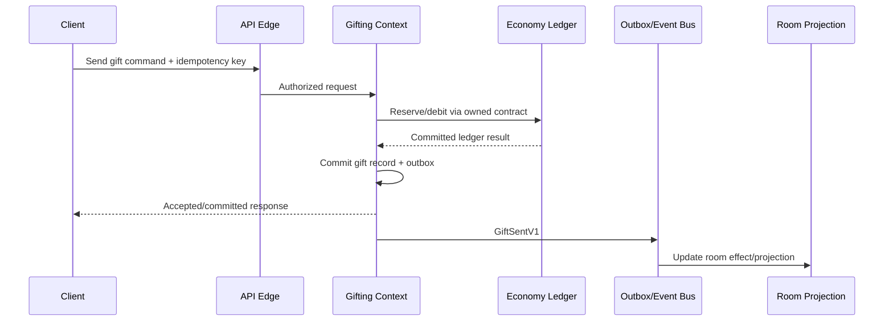

# ARC-006 — Communication Patterns

| Field | Value |
|---|---|
| Document ID | ARC-006 |
| Category | Architecture |
| Version | 2.1.0 |
| Status | Ratified Specification |
| Maturity | Level 2 — Specification |
| Owner | Phoenix Architecture Council |
| Authority | Normative |
| Depends On | ARC-001 through ARC-005; DPL-015 through DPL-019 |
| Required By | APIs, workflows, events, integration and implementation reviews |
| Review Trigger | Material topology, SLO, provider, residency, or scale change |

## Executive Summary

Phoenix uses the least-coupled communication pattern that still protects the business invariant. Synchronous calls are reserved for immediate decisions and user-visible acknowledgement. Asynchronous events are used for propagation, projections, notifications, analytics, search, recommendation, and other work that may complete after the authoritative transaction. Cross-context data exchange is governed by contracts; direct database integration is prohibited.

## Design Goals

- Preserve bounded-context ownership.
- Keep critical user journeys understandable and observable.
- Prevent hidden distributed transactions.
- Support retries, idempotency, reconciliation, and partial failure.
- Avoid coupling product availability to non-critical consumers.
- Permit later service extraction without rewriting domain contracts.

## Decision Matrix

| Need | Default pattern | Reason | Prohibited shortcut |
|---|---|---|---|
| Immediate authorization or validation | Synchronous API | Caller requires a present decision | Reading another context's tables |
| Commit and publish a business fact | Local transaction + outbox | Atomic ownership and reliable publication | Dual write to DB and broker |
| Cross-context long-running workflow | Saga | Explicit state, timeout, compensation | Holding a distributed transaction |
| Projection, feed, search, analytics | Asynchronous event | Derived and rebuildable | Blocking the source transaction |
| Provider callback | Adapter + verified webhook + inbox | Trust boundary and replay protection | Direct state mutation without verification |
| High-volume live updates | Stream/channel with durable control plane | Separate ephemeral delivery from authoritative state | Treating transport packets as business truth |
| Bulk or historical exchange | Versioned batch contract | Efficient, auditable transfer | Ad hoc database dump |

## Architecture Patterns

### Synchronous Request/Response

Use for commands or queries that need an immediate answer. Calls must have explicit timeouts, bounded retries, correlation IDs, authentication context, and a documented fallback. Synchronous chains should normally remain shallow; a user request must not depend on a long sequence of remote services.

### Transactional Outbox and Consumer Inbox

A context writes its authoritative state and outbox record in one local transaction. A relay publishes the event. Consumers persist an inbox/idempotency record before applying effects. This is the standard pattern for durable integration events.

### Saga

A saga coordinates multiple local transactions. Each step has an owner, timeout, retry policy, terminal state, and compensation or reconciliation path. Orchestration is preferred when the workflow is financially or operationally sensitive; choreography is acceptable for simple, low-risk propagation.

### Query Composition and Read Models

Cross-context screens should prefer dedicated read models or API composition rather than joins across owned stores. Read models are derived, versioned, rebuildable, and clearly marked non-authoritative.

### Real-Time Delivery

WebSocket, WebRTC data channels, push gateways, and streaming transports may deliver presence, typing, room reactions, and live effects. Authoritative changes still pass through the owning context and durable contract when required.

## Engineering Rules

1. Every cross-context call or event has a named producer, consumer, owner, contract, and failure policy.
2. Commands are imperative requests; events are past-tense facts.
3. At-least-once delivery is assumed for durable messaging; consumers must be idempotent.
4. Ordering is guaranteed only where explicitly designed, usually per aggregate or partition key.
5. Exactly-once claims require a written proof and ADR; transport marketing language is insufficient.
6. Retries use exponential backoff, jitter, limits, and dead-letter or quarantine handling.
7. Timeouts are shorter than the caller's remaining deadline.
8. Synchronous remote calls are not made while holding a database transaction open unless an ADR approves it.
9. Sensitive payloads are minimized and classified under DPL-011.
10. Correlation and causation identifiers propagate across the workflow.

## Reference Flow — Gift Send

The room animation may be delayed without changing the ledger truth.

## Anti-Patterns

- Shared database as an integration bus.
- Unbounded synchronous call chains.
- Fire-and-forget commands without durable state.
- Events containing full entity snapshots by default.
- Silent retry loops with no deadline or alert.
- Business logic embedded in gateways or brokers.
- Using a cache or search index as authoritative truth.

## Security Considerations

Authentication context is propagated but re-authorized at the owning context. Webhooks require signature validation, replay protection, source allow-listing where practical, and secret rotation. Message topics and schemas are access-controlled. Payload logging follows classification and redaction rules.

## Operational Considerations

Track latency, timeout rate, retry count, queue age, consumer lag, dead-letter volume, idempotency collisions, and saga age. Every critical workflow has a runbook and reconciliation query.

## AI Context

AI systems may consume governed events and read models but may not bypass domain contracts. Model decisions that affect visibility, safety, money, or access must include model/policy version, confidence or decision metadata where appropriate, and an auditable human or policy override path.

## Future Evolution

Release-specific protocols may evolve from in-process calls to network APIs or event streams without changing business ownership. Contract compatibility and observability remain mandatory during extraction.

## Architectural Integrity Check

A design conforms when ownership is clear, the pattern matches the invariant, failure is explicit, retries are safe, contracts are versioned, and no derived system becomes authoritative.

## References

- DPL-015 Data Consistency Model
- DPL-018 Data Contracts
- DPL-019 Event Modeling
- ARC-002 Bounded Contexts
- ARC-003 Domain Map
