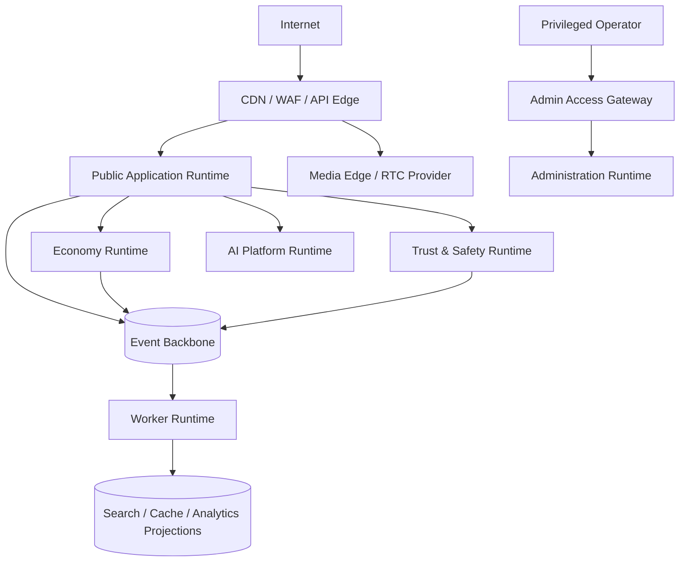

# ARC-007 — Deployment Philosophy

| Field | Value |
|---|---|
| Document ID | ARC-007 |
| Category | Architecture |
| Version | 2.1.0 |
| Status | Ratified Specification |
| Maturity | Level 2 — Specification |
| Owner | Phoenix Architecture Council |
| Authority | Normative |
| Depends On | ARC-001, ARC-002, ARC-005, ARC-006 |
| Required By | Cloud, environments, delivery, runtime topology and operations |
| Review Trigger | Material topology, SLO, provider, residency, or scale change |

## Executive Summary

Phoenix begins with a small number of independently releasable deployable units built from strongly separated modules. Deployment topology follows risk, scale, availability, residency, and operational evidence—not fashion. Logical bounded contexts remain authoritative even when initially packaged together. Critical financial, identity, trust, and administrative capabilities receive stronger isolation and change control.

## Design Goals

- Ship safely with low operational burden.
- Preserve future extraction paths.
- Separate public, internal, data, and administrative trust zones.
- Support repeatable environments and reversible delivery.
- Keep stateful systems explicit and recoverable.
- Avoid premature multi-region complexity.

## Initial Deployable Units

| Unit | Primary contents | Isolation rationale |
|---|---|---|
| Public Application Runtime | Profile, social graph, content, room control, messaging APIs | Main product surface; modular internal boundaries |
| Economy Runtime | Wallet, ledger, purchase verification, gifts, payouts | Financial correctness, audit, restricted access |
| Trust and Safety Runtime | Reports, enforcement, moderation workflows, policy execution | Sensitive evidence and independent operational controls |
| AI Platform Runtime | Inference gateway, feature access, model registry hooks, evaluation adapters | Governed model lifecycle and resource isolation |
| Worker Runtime | Outbox relay, projections, notifications, indexing, media jobs | Async scaling and blast-radius control |
| Administration Runtime | Back-office APIs and UI | Privileged zone, stronger authentication and logging |

These are reference units, not a mandate for one repository or one process forever. A smaller MVP may combine non-critical units while preserving module, schema, and permission boundaries.

## Environment Model

- **Local:** developer tooling and isolated test data.
- **Integration:** contract and migration verification.
- **Staging:** production-like topology with synthetic or approved data.
- **Production:** controlled access, immutable delivery records, monitored SLOs.
- **Ephemeral preview:** optional for change review; must not depend on production secrets or unrestricted data.

Configuration is externalized, validated at startup, and separated from secrets. Environment differences are declared rather than hidden in manual steps.

## Delivery Strategy

Default progression: build → static/security checks → unit/contract tests → migration validation → deploy to non-production → smoke tests → controlled production rollout → health verification.

Use rolling delivery for ordinary stateless changes, canary delivery for behaviorally risky changes, and blue/green only when its operational cost is justified. Feature flags decouple code deployment from product release, but flags have owners and expiry dates.

## State and Migrations

Database changes use expand–migrate–contract. Destructive changes do not occur in the same rollout that introduces replacements. Backfills are resumable, observable, rate-limited, and reversible where possible. Stateful infrastructure has tested backup, restore, and recovery objectives.

## Decision Matrix

| Condition | Deployment choice |
|---|---|
| Low traffic, low risk, same team | Shared runtime with strict modules |
| Independent scaling pressure | Separate worker or service deployment |
| Financial or privileged boundary | Dedicated runtime and credentials |
| Different data residency | Region-specific deployment/data plane |
| Specialized media or AI hardware | Dedicated workload pool |
| Frequent independent releases causing coordination cost | Extract deployable unit after ADR |

## Engineering Rules

1. Infrastructure is defined as code and reviewed.
2. Artifacts are immutable and promoted; production is not built manually.
3. Secrets never live in repository files or container images.
4. Every deployable unit exposes health, readiness, version, and dependency status.
5. Rollback and roll-forward plans are documented before high-risk release.
6. Runtime identities use least privilege and separate credentials by unit and environment.
7. Production access is time-bound, attributable, and audited.
8. Deployment does not require direct manual mutation of production databases.
9. Capacity limits and autoscaling bounds are explicit.
10. Provider-specific dependencies are wrapped behind Phoenix-owned interfaces where portability matters.

## Topology Sketch

## Anti-Patterns

- One deployment per class or table.
- Hand-built production servers.
- Shared production credentials across workloads.
- Environment-specific code branches.
- Migrations that require synchronized global downtime.
- Scaling stateful and stateless work as one unit.
- Exposing administrative services through the ordinary public trust path.

## Security Considerations

Network segmentation complements, but does not replace, application authorization. Supply-chain controls include dependency pinning, artifact provenance, vulnerability scanning, and controlled base images. Administrative and economy deployments require stronger authentication, audit, and break-glass procedures.

## Operational Considerations

Each unit has service ownership, dashboards, alerts, runbooks, deployment frequency, change failure rate, rollback time, resource saturation, and cost visibility. Deployment health is judged by user and business signals, not only process status.

## AI Context

AI workloads have separate quotas, model versions, feature contracts, safety policies, and fallback behavior. A model deployment may be rolled back independently from the product runtime. Model artifacts and prompts/configuration are versioned and auditable.

## Future Evolution

Multi-region deployment is introduced only after residency, routing, consistency, failover, and operational ownership are explicit. Active-active writes are limited to domains with proven conflict rules.

## Architectural Integrity Check

A topology is acceptable when it preserves context ownership, limits blast radius, supports safe delivery and recovery, and does not create operational complexity without measurable value.

## References

- ARC-005 System Landscape
- ARC-006 Communication Patterns
- DPL-016 Data Versioning
- PES-002 Architecture Standard
