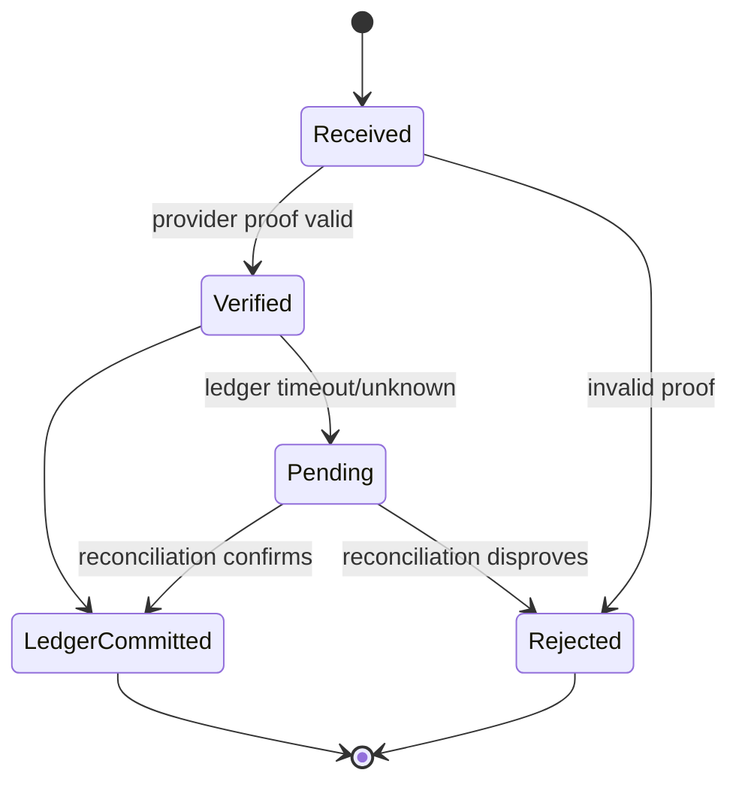

# ARC-009 — Failure Isolation

| Field | Value |
|---|---|
| Document ID | ARC-009 |
| Category | Architecture |
| Version | 2.1.0 |
| Status | Ratified Specification |
| Maturity | Level 2 — Specification |
| Owner | Phoenix Architecture Council |
| Authority | Normative |
| Depends On | ARC-005 through ARC-008; DPL-015, DPL-017, DPL-019 |
| Required By | Resilience, incident response, service design and operational readiness |
| Review Trigger | Material topology, SLO, provider, residency, or scale change |

## Executive Summary

Phoenix assumes dependencies fail, messages are duplicated, providers slow down, regions become impaired, and operators make mistakes. Failure isolation limits the affected capability, user population, data set, and time window. The platform favors explicit degraded modes over cascading failure and preserves authoritative truth even when derived experiences are delayed.

## Failure Domains

- Request and process.
- Deployable unit.
- Database or partition.
- Queue, topic, or consumer group.
- Availability zone and region.
- External provider.
- Privileged operator and administrative action.
- Model/version or AI provider.
- User, room, conversation, account, or tenant-like logical cell.

## Criticality Tiers

| Tier | Examples | Expected behavior |
|---|---|---|
| T0 — Integrity critical | Ledger, account security, enforcement, audit | Fail closed or enter explicit pending state; no silent loss |
| T1 — Core real-time | Messaging acknowledgement, room control | Rapid recovery and bounded degradation |
| T2 — Product experience | Feed, search, notifications | Stale/cached/simplified response acceptable |
| T3 — Background | Analytics, enrichment, ranking refresh | Delay, pause, sample, or replay later |

## Isolation Patterns

### Timeouts and Deadlines

Every remote operation has a timeout derived from the end-to-end deadline. Deadlines propagate. A timeout is treated as an unknown outcome where the remote side may have completed; idempotency and status queries resolve ambiguity.

### Circuit Breakers and Bulkheads

Circuit breakers stop repeated calls to an unhealthy dependency. Bulkheads separate connection pools, queues, worker pools, and quotas by criticality or workload class so low-priority work cannot starve critical work.

### Retry Discipline

Retry only transient, safe operations. Use exponential backoff, jitter, attempt limits, and retry budgets. Never multiply retries across every layer. Non-idempotent commands require an idempotency key or a status-resolution workflow.

### Queues and Dead Letters

Queues absorb bursts but do not hide permanent failure. Poison messages move to quarantine with reason, payload reference, contract version, and replay controls. Queue age is a first-class health signal.

### Graceful Degradation

Examples include cached feed, disabled recommendations, delayed notification, text-only room mode, alternate media provider, queued moderation review, and explicit payment pending state. Degradation must not misrepresent balances, permissions, or enforcement.

### Reconciliation

Critical cross-system state has periodic reconciliation. Reconciliation is deterministic, auditable, rate-limited, and able to generate repair commands or human cases without rewriting history silently.

## Decision Matrix

| Failure | Immediate action | Recovery |
|---|---|---|
| Search unavailable | Return cached/basic results | Rebuild/replay index |
| Notification provider unavailable | Queue with expiry and priority | Retry or alternate provider |
| AI inference unavailable | Use deterministic/default behavior | Restore model route; replay optional enrichment |
| Ledger dependency timeout | Return pending/unknown, do not double charge | Query by idempotency key and reconcile |
| Event consumer failure | Pause/redirect partition if needed | Fix, replay from offset/inbox |
| Hot live room | Isolate room workload, shed decorative events | Rebalance or migrate room control |
| Admin credential compromise | Revoke sessions/keys, freeze privileged actions | Audit, rotate, investigate, restore under approval |
| Region impairment | Route supported stateless traffic; respect data rules | Controlled failover and reconciliation |

## Engineering Rules

1. Every critical dependency has timeout, retry, circuit, fallback, and ownership policy.
2. Failure of derived systems cannot corrupt authoritative state.
3. No silent data loss: rejected, expired, quarantined, or compensated work is observable.
4. Health checks distinguish process health, readiness, dependency impairment, and business health.
5. One failing room, user, provider, model, or partition should not exhaust global resources.
6. Break-glass actions are limited, approved, logged, and reviewed.
7. Chaos and game-day tests begin with low-risk environments and explicit hypotheses.
8. Recovery procedures are tested, not merely documented.
9. RTO/RPO are assigned by criticality and validated with restore exercises.
10. Incident fixes that change architecture produce an ADR or specification update.

## Failure Flow — Provider Purchase

The client retry uses the same idempotency key and cannot create a second credit.

## Anti-Patterns

- Infinite retries.
- Global circuit breaker for unrelated partitions.
- Returning success before durable acceptance.
- Automatic failover that violates data residency or creates split brain.
- Using health endpoints that always return 200.
- Treating queue depth as success rather than deferred work.
- Manual database repair without audit and reconciliation record.

## Security Considerations

Attack, abuse, and compromise are failure modes. Isolation includes rate limits, credential scopes, privileged zones, tenant/user quotas, suspicious-workload containment, and immutable security audit. Fail-open is prohibited for authorization, economy, enforcement, and sensitive-data access unless explicitly approved.

## Operational Considerations

Each tier has alert thresholds, runbooks, escalation, service owner, dependency map, and recovery test cadence. Incident metrics include detection time, containment time, recovery time, data ambiguity, affected users, and recurrence prevention.

## AI Context

A faulty model version is isolated by model route, cohort, language, region, and capability. Safety-sensitive AI decisions require deterministic policy boundaries and rollback. Training data or feature pipeline failures do not automatically propagate corrupt artifacts to production.

## Future Evolution

Phoenix may adopt cell-based isolation for large user populations, dedicated economy cells, regional room clusters, and provider diversification. These require proven routing, identity, data, and reconciliation semantics.

## Architectural Integrity Check

A design passes when failures remain bounded, critical truth is protected, degraded behavior is honest, recovery is testable, and ambiguous outcomes are resolved through idempotency and reconciliation.

## References

- DPL-015 Data Consistency Model
- DPL-017 Audit Strategy
- ARC-006 Communication Patterns
- ARC-008 Scalability Strategy
