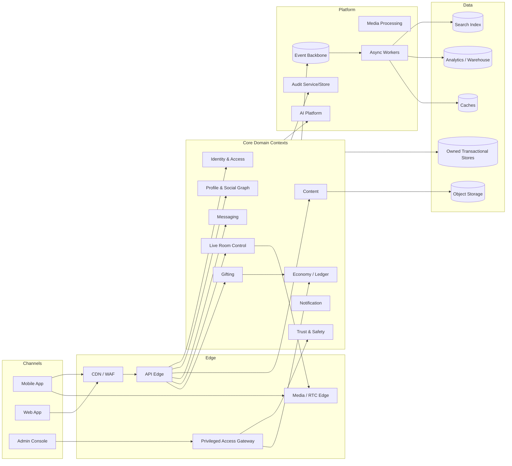
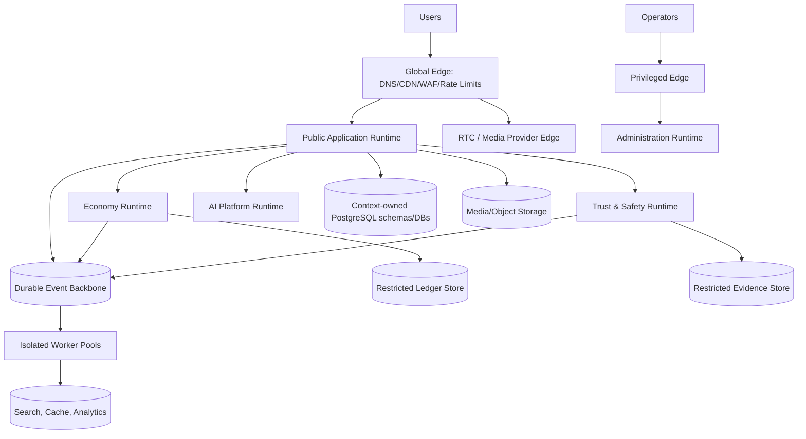

# ARC-010 — Reference Architecture

| Field | Value |
|---|---|
| Document ID | ARC-010 |
| Category | Architecture |
| Version | 2.1.0 |
| Status | Ratified Specification |
| Maturity | Level 2 — Specification |
| Owner | Phoenix Architecture Council |
| Authority | Normative |
| Depends On | ARC-001 through ARC-009; DPL-010 through DPL-019; PEF/PES standards |
| Required By | Phoenix implementation planning, security foundation and phoenix-core |
| Review Trigger | Material topology, SLO, provider, residency, or scale change |

## Executive Summary

This document assembles the ratified Architecture Foundation into a coherent reference architecture. It defines logical ownership, reference deployable units, data and communication paths, trust zones, resilience boundaries, and implementation gates. It is technology-guiding rather than technology-locking: PostgreSQL is the default transactional source, durable events use outbox/inbox semantics, and specialized systems remain derived unless an ADR grants authority.

## Reference Principles

1. Business capability and bounded context precede service count.
2. One context owns each authoritative business fact.
3. Public, privileged, financial, trust, AI, and data-processing zones are separated.
4. Local transactions protect local invariants; sagas coordinate cross-context work.
5. Durable integration assumes at-least-once delivery and idempotent consumption.
6. Search, feeds, rankings, analytics, caches, and projections are rebuildable.
7. Economy, account security, enforcement, and audit receive stronger isolation.
8. Real-time media transport is distinct from authoritative room control.
9. AI supports governed decisions but does not silently become policy authority.
10. Architecture evolves through evidence, ADRs, contracts, and maturity reviews.

## Logical Architecture

Arrows represent governed communication, not shared-table access.

## Reference Deployable Topology

The MVP may implement context-owned schemas within fewer PostgreSQL clusters, provided credentials, migrations, ownership, and access rules prevent cross-context table coupling.

## Primary Journeys

### Registration and Login

Identity owns credentials, sessions, risk signals, and authentication events. Profile creation follows through an idempotent workflow. Notification and analytics are asynchronous. Failure of recommendations or analytics does not block account creation.

### Message Send

Messaging validates membership and policy, commits message metadata/content reference, writes outbox, and acknowledges durable acceptance. Delivery, push notification, moderation enrichment, and search indexing follow asynchronously. Ordering is per conversation partition where required.

### Live Room

Room control owns membership, roles, mute/ban state, and lifecycle. RTC provider handles media transport through an adapter. Presence and reactions may be ephemeral; role, enforcement, economy, and moderation facts are durable.

### Gift and Economy

Gifting owns product semantics and presentation; Economy owns balances, ledger entries, purchase verification, and payout state. The ledger commits before a GiftSent event is published. Visual effects are derived and replayable.

### Safety Report

Trust and Safety owns report intake, evidence references, triage, enforcement, appeal, and policy version. AI may prioritize or classify, but governed policy and authorized review determine material enforcement.

## Data Architecture

- PostgreSQL is the default source for authoritative transactional state.
- Context ownership is enforced by API/module boundaries, schema privileges, migrations, and code ownership.
- Object storage holds media and large artifacts with lifecycle and access metadata.
- Redis-like caches are accelerators, not truth.
- Search indexes and analytics stores consume governed contracts and can be rebuilt.
- Audit stores are append-oriented, access-controlled, and distinct from operational logs.
- Financial ledger records are immutable by business semantics; corrections use compensating entries.

## Communication Architecture

- Client-to-platform: versioned APIs and real-time channels.
- Context-to-context immediate decisions: synchronous contract with deadline.
- Durable propagation: outbox → event backbone → inbox/idempotent consumer.
- Long workflows: saga with explicit states and compensation/reconciliation.
- Providers: anti-corruption adapters, verified callbacks, idempotency, reconciliation.
- Bulk/analytics: versioned batch or streaming data contracts.

## Security Architecture Baseline

- Central identity with context-level authorization.
- Least-privilege workload identities.
- Separate privileged administration path.
- Encryption in transit and at rest with managed key policies.
- Classified data handling and minimization.
- Immutable audit for privileged, financial, identity, and enforcement actions.
- Secret management outside source and artifacts.
- Rate limits, abuse prevention, and resource quotas at edge and context.
- Supply-chain scanning and provenance for deployable artifacts.

Detailed controls are deferred to Security Foundation, which must not contradict this baseline.

## Reliability and Scale Baseline

- Stateless horizontal scale for public APIs where possible.
- Partition messaging by conversation and rooms by room ID.
- Isolate economy, trust, AI, worker, and privileged workloads.
- Use bounded queues, backpressure, circuit breakers, and graceful degradation.
- Protect critical truth when providers or derived systems fail.
- Measure tail latency, queue age, partition skew, saturation, error rate, and cost.
- Introduce regional and cell architectures only with explicit routing, consistency, and recovery rules.

## Technology Guidance

| Concern | Default direction | Status |
|---|---|---|
| Transactional database | PostgreSQL | Ratified default |
| Cache | Redis-compatible managed cache | Candidate; ADR before adoption |
| Durable events | Managed broker supporting partitions and replay | Capability requirement; vendor open |
| Object storage | S3-compatible managed storage | Candidate |
| Search | Dedicated search engine | Derived; vendor open |
| API style | REST/JSON initially; internal RPC only where justified | Guided, not frozen |
| Real-time signaling | WebSocket/managed gateway | Candidate |
| Media transport | WebRTC/managed RTC adapter | Provider open |
| Deployment | Containers on managed platform | Candidate; avoid premature orchestration burden |
| Observability | OpenTelemetry-compatible signals | Capability requirement |

No candidate becomes binding without ADR, operational owner, cost model, and exit/migration consideration.

## Implementation Sequence

1. Ratify Security Foundation and initial threat model.
2. Select MVP capabilities and service-level objectives.
3. Define context modules, APIs, events, schemas, and ownership tests.
4. Establish identity, audit, data migration, observability, and delivery foundations.
5. Implement a vertical slice: identity → profile → messaging or room control.
6. Add trust controls before broad user-generated content exposure.
7. Add economy only with ledger tests, reconciliation, provider verification, and privileged controls.
8. Introduce AI features behind governed evaluation and fallback.
9. Load/failure test critical journeys.
10. Promote maturity only with production evidence.

## Architecture Decision Matrix

| Decision | Default | Escalation trigger |
|---|---|---|
| Module vs service | Module in a controlled deployable unit | Independent scale/risk/availability/team need |
| Sync vs async | Sync for immediate decision; async for propagation | User invariant or latency budget demands otherwise |
| Shared cluster vs dedicated store | Shared infrastructure with owned schemas/credentials | Risk, regulation, scale, recovery or noisy-neighbor evidence |
| Single region vs multi-region | Single primary region with recovery plan | Residency, latency, availability and operational readiness |
| Build vs provider | Provider for commodity capability behind adapter | Strategic differentiation, cost, control, compliance |
| Exact vs eventual read | Strongest needed, not strongest possible | Business invariant and user harm analysis |

## Anti-Patterns

- Microservices as an organizational aspiration without operational readiness.
- Shared tables as integration contracts.
- Global event bus with unowned event soup.
- Exactly-once or active-active claims without proof.
- AI gateway that bypasses consent, policy, or data classification.
- Admin tools with direct unrestricted database access.
- Treating a provider callback as trusted final truth without verification.
- Building economy before audit, reconciliation, and incident controls.

## Operational Readiness Gate

A deployable capability requires: owner, on-call path, SLO or service objective, dashboards, alerts, runbook, dependency map, data classification, backup/recovery plan, security review, capacity estimate, migration/rollback plan, and test evidence.

## AI Context

AI Platform manages model routing, versions, evaluation, safety configuration, feature access, and telemetry. Domain contexts define the allowed decision and own user-facing consequences. High-impact outputs require traceability, policy constraints, rollback, and appeal or human review where appropriate.

## Future Evolution

Possible future stages include dedicated messaging clusters, room cells, regional data planes, specialized graph and recommendation systems, multi-provider AI routing, and independent economy infrastructure. Evolution is incremental and contract-preserving.

## Architectural Integrity Check

The reference architecture is intact when business ownership remains explicit, deployable topology follows evidence, all cross-boundary exchange is governed, critical truth survives partial failure, privileged paths are isolated, and derived/AI systems cannot silently redefine authority.

## References

- ARC-001 through ARC-009
- DPL-010 through DPL-019
- PEF-001 Engineering Principles
- PES-002 Architecture Standard
- PES-003 AI Engineering Standard
