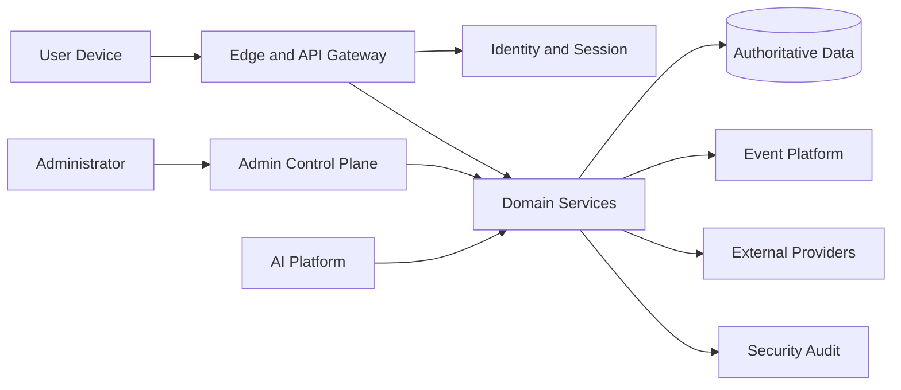

# SEC-002 — Threat Model

## Executive Summary

Phoenix uses a living threat model organized around assets, actors, trust boundaries, abuse cases, attack paths, controls, residual risk, and verification evidence.

The model covers conventional cybersecurity threats and platform-abuse threats because a global social platform can be harmed through account takeover, fraud, harassment, manipulation, coordinated abuse, privileged misuse, unsafe AI behavior, and third-party compromise.

## Protected Assets

| Asset | Primary harm |
|---|---|
| Account identity and recovery | Account takeover, impersonation, lockout |
| Private messages and media | Confidentiality breach, coercion, reputational harm |
| Voice-room control and presence | Unauthorized access, disruption, harassment |
| Wallet, gifts, purchases, payouts | Theft, fraud, double-spend, ledger corruption |
| Trust and moderation decisions | Evasion, wrongful enforcement, manipulation |
| Administrator capabilities | Broad platform compromise |
| Secrets and signing keys | Persistent unauthorized access |
| Audit evidence | Concealment, repudiation, failed investigations |
| Recommendation and AI systems | Manipulation, unsafe amplification, data leakage |
| Availability | Service disruption and loss of trust |

## Threat Actors

- Opportunistic attackers.
- Organized fraud groups.
- Abusive or malicious users.
- Compromised creators, agencies, or merchants.
- Insiders with legitimate or excessive access.
- Compromised third-party providers.
- Automated bots and coordinated influence networks.
- Supply-chain attackers.
- Attackers targeting AI models, prompts, training data, or tool access.

## Trust Boundaries

Each arrow is a trust transition requiring identity, authorization, validation, confidentiality, integrity, replay protection where applicable, and observable outcomes.

## Core Threat Scenarios

### Account and Session

- Credential stuffing and password reuse.
- SIM-swap or email compromise during recovery.
- Session theft, token replay, device compromise.
- Abuse of refresh tokens or long-lived sessions.
- Enumeration of accounts and recovery channels.

### Social and Content

- Harassment, doxxing, impersonation, grooming, and coordinated abuse.
- Malicious links, files, media, and social engineering.
- Unauthorized room entry or privilege escalation.
- Scraping and large-scale data extraction.
- Recommendation manipulation and artificial engagement.

### Economy

- Gift duplication, replay, forged purchase confirmation.
- Wallet balance manipulation.
- Refund, chargeback, payout, and promotion abuse.
- Provider webhook spoofing.
- Insider override or administrative collusion.

### Platform and Infrastructure

- Injection, insecure deserialization, request smuggling, SSRF, and access-control failure.
- Compromised CI/CD, dependency, image, or artifact.
- Secret leakage through code, logs, support tools, or analytics.
- Denial of service and resource exhaustion.
- Cross-tenant or cross-region data exposure.

### AI and Automation

- Prompt injection through user or retrieved content.
- Sensitive-data disclosure through model context.
- Tool abuse by an AI agent.
- Model evasion, poisoning, or adversarial manipulation.
- Automated enforcement without sufficient evidence or appeal.

## Threat Analysis Method

For each capability, Phoenix records:

1. asset and owner;
2. entry points;
3. trust boundaries;
4. threat actor and objective;
5. preconditions;
6. attack path;
7. preventive controls;
8. detective controls;
9. recovery controls;
10. residual risk;
11. verification method;
12. review trigger.

## Risk Rating

Risk is evaluated using impact, likelihood, exploitability, exposure, detection difficulty, and recovery complexity. Financial theft, mass private-data exposure, persistent privileged compromise, and large-scale wrongful enforcement are treated as critical even when likelihood is uncertain.

## Decision Matrix

| Risk class | Required response |
|---|---|
| Critical | Block release or isolate capability until reduced and independently reviewed |
| High | Named owner, mitigation plan, test evidence, monitored residual risk |
| Medium | Planned control with acceptance criteria and review date |
| Low | Documented acceptance or low-cost mitigation |

## Abuse-Case Example: Gift Replay

1. An attacker captures or recreates a gift request.
2. The request is submitted repeatedly.
3. Without idempotency and ledger invariants, value may be duplicated.
4. Controls: authenticated session, nonce/idempotency key, authoritative ledger transaction, provider verification, replay window, anomaly detection, reconciliation, immutable financial audit.

## AI Threat-Model Requirements

- Treat retrieved content as untrusted input.
- Separate model instructions from user-controlled data.
- Restrict tools by capability and data scope.
- Require human approval for high-impact actions.
- Record model, policy, prompt template, evidence, and result for material decisions.
- Test for prompt injection, data exfiltration, policy bypass, and unsafe automation.

## Anti-Patterns

- A threat model produced once and never updated.
- Generic lists without mapping to Phoenix assets and workflows.
- Scoring that hides critical business impact behind averages.
- Ignoring abuse because it is not a traditional network attack.
- Treating third-party assurances as a substitute for integration controls.
- Omitting recovery and investigation requirements.

## Operational Considerations

Threat reviews occur before release of new high-risk capabilities, after major incidents, when adding external providers, when crossing new trust boundaries, and when changing identity, economy, moderation, AI, or data-residency design.

## Implementation Notes

Use lightweight diagrams and structured threat records in the repository. High-risk findings should link to backlog items, tests, runbooks, and release gates.

## Future Evolution

Later releases should add capability-specific threat models for onboarding, messaging, live voice, gifts, wallet, payouts, moderation, administration, and AI-assisted experiences.

## Architectural Integrity Check

- Are all material assets named?
- Are both attacker and abuse scenarios covered?
- Are controls preventive, detective, and recoverable?
- Is residual risk explicit?
- Does every critical risk have a release-blocking rule?

## References

- SEC-001 Security Vision and Principles
- ARC-005 System Landscape
- ARC-010 Reference Architecture
- DPL-011 Data Classification
- DPL-017 Audit Strategy
