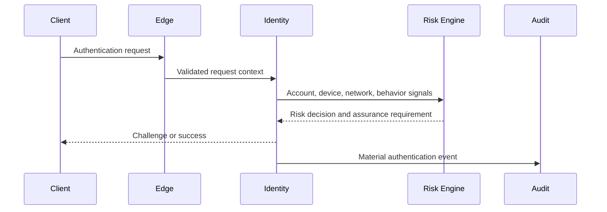

# SEC-003 — Identity and Authentication

## Executive Summary

Phoenix separates identity proof, account identity, authentication factors, sessions, devices, recovery, and authorization. Authentication proves an identity claim at a defined assurance level; it does not itself grant a business permission.

## Identity Model

- **Person/account identity:** the platform account and its stable opaque identifier.
- **Authentication identity:** credentials or federated assertions used to authenticate.
- **Device identity:** a risk signal, not an unquestionable proof of personhood.
- **Workload identity:** a service, job, or automation principal.
- **Administrator identity:** named human identity with stronger assurance and audit.
- **External identity:** provider-issued identity mapped through a Phoenix-owned binding.
- **AI agent identity:** explicit non-human principal with bounded tools and scopes.

## Authentication Methods

Phoenix should support a risk-appropriate combination of:

- passkeys/WebAuthn where clients and markets support them;
- verified email or phone onboarding;
- strong passwords where needed, stored using a modern adaptive password hash;
- federated sign-in through governed provider adapters;
- multi-factor authentication for privileged and high-risk users;
- step-up authentication for sensitive actions.

No single channel is assumed globally reliable. Recovery design must account for number recycling, email compromise, lost devices, migration, and accessibility.

## Session Architecture

| Element | Rule |
|---|---|
| Access token | Short-lived, audience-bound, minimal claims |
| Refresh token | Rotating, revocable, protected from replay |
| Session record | Server-visible state for revocation and risk response |
| Device record | Risk context, not sole authorization source |
| Token storage | Platform-appropriate secure storage |
| Logout | Revokes current session; global logout revokes all sessions |
| Sensitive change | May revoke other sessions and require step-up |
| Suspicious activity | Challenge, restrict, revoke, or recover based on risk |

## Authentication Flow

## Account Recovery

Recovery is a privileged security workflow, not a convenience bypass. It must:

1. avoid revealing whether an account exists;
2. evaluate available trusted factors and recent changes;
3. apply delay or cooling-off periods where appropriate;
4. notify existing trusted channels;
5. revoke or re-evaluate active sessions;
6. record reason, evidence, actor, and outcome;
7. resist support-channel social engineering;
8. provide appeal and restoration paths.

## Step-Up Authentication Triggers

- payout or withdrawal changes;
- password, passkey, phone, or email changes;
- account recovery;
- administrator privilege use;
- device or session management;
- export of sensitive account data;
- suspicious location, device, behavior, or automation;
- high-risk economy transactions.

## Workload Authentication

Services and jobs use workload identities and short-lived credentials. Static shared secrets are prohibited as the normal service-authentication mechanism. Credentials must be audience-scoped, rotated, revocable, and attributable.

## Decision Matrix

| Situation | Required assurance |
|---|---|
| Read public content | Anonymous or low assurance |
| Post or message | Authenticated session |
| Change profile | Authenticated, recent session |
| Change recovery factor | Step-up plus notification |
| Send high-value gift | Step-up based on risk |
| Approve payout | Strong MFA and segregation of duties |
| Use admin control | Strong MFA, managed device or equivalent, full audit |
| AI agent invokes tool | Workload identity plus explicit bounded permission |

## Security Rules

1. Authentication errors must not enable account enumeration.
2. Tokens must be audience-bound and validated for issuer, expiry, signature, and intended use.
3. Refresh-token replay must trigger containment.
4. Password reset must not silently preserve attacker sessions.
5. Rate limits must combine account, device, network, and behavior signals.
6. Authentication events must be observable without logging credentials.
7. Identity-provider outages require explicit degraded-mode behavior.
8. Account merge and identity linking require strong proof and rollback strategy.

## Anti-Patterns

- Permanent bearer tokens.
- Using user IDs as secrets.
- Trusting client-provided roles.
- Treating SMS as universally strong authentication.
- Recovery through knowledge questions.
- Storing plaintext passwords, one-time codes, or full authentication payloads.
- Silent identity linking based only on matching email.
- Allowing support staff to bypass recovery controls without audit and dual approval.

## Privacy Considerations

Risk systems must minimize and retain signals proportionately. Device fingerprints and behavioral signals can be privacy-sensitive and require purpose, access, retention, and user-impact governance.

## Operational Considerations

Identity operations require revocation, provider failover, key rotation, abuse monitoring, recovery review, session investigation, and emergency account protection.

## Implementation Notes

The first implementation should centralize authentication protocol handling while allowing domain contexts to enforce their own authorization. Session and credential schemas must be versioned and auditable.

## Future Evolution

Future releases may define verified identity tiers, age assurance, regional provider strategies, delegated account management, and creator/business identity.

## Architectural Integrity Check

- Is authentication separated from authorization?
- Can every session and credential be revoked?
- Is recovery at least as strong as normal authentication?
- Are workload and AI identities explicit?
- Can suspicious authentication be investigated without exposing secrets?

## References

- DPL-013 Global Identifiers
- DPL-017 Audit Strategy
- ARC-002 Bounded Contexts
- ARC-010 Reference Architecture
