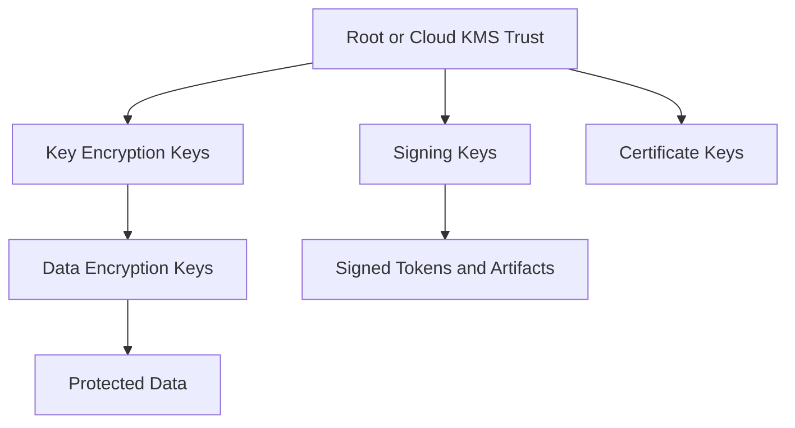

# SEC-005 — Secrets and Key Management

## Executive Summary

Phoenix manages secrets, signing keys, encryption keys, certificates, provider credentials, and recovery material as governed assets. Secrets must not live in source code, documentation, container images, client applications, chat transcripts, or ordinary logs.

## Asset Types

- API keys and provider credentials.
- Database and message-broker credentials.
- Token-signing keys.
- TLS certificates and private keys.
- Encryption and key-encryption keys.
- Webhook verification secrets.
- CI/CD and deployment credentials.
- Recovery and break-glass material.
- AI-provider credentials and tool tokens.

## Core Requirements

1. Centralized approved secret storage.
2. Encryption at rest and in transit.
3. Short-lived credentials where supported.
4. Workload identity instead of static secret distribution.
5. Separation by environment, context, and privilege.
6. Rotation and revocation procedures.
7. Access logging and anomaly monitoring.
8. Backup and recovery for critical key material.
9. No secret exposure to untrusted clients.
10. Automated secret scanning in source and delivery pipelines.

## Key Hierarchy

Root trust must be strongly protected and rarely accessed. Application data should normally be protected with lower-level keys that can be rotated independently.

## Rotation Strategy

| Asset | Rotation approach |
|---|---|
| Workload credential | Short-lived and automatically renewed |
| Provider API key | Scheduled and incident-triggered rotation |
| Token-signing key | Overlapping key set with identifier and controlled retirement |
| Data-encryption key | Envelope encryption and versioned key reference |
| Webhook secret | Dual-secret overlap during provider transition |
| Break-glass credential | Sealed, monitored, tested, and rotated after use |

## Signing-Key Rules

- Every signed token or artifact identifies the key version.
- Verifiers accept only approved algorithms and issuers.
- Rotation permits overlap without indefinite legacy acceptance.
- Compromise supports rapid revocation and session impact analysis.
- Private signing material is never exported when managed signing is available.

## Secret Distribution

Applications retrieve secrets at runtime through workload identity and approved secret infrastructure. Secrets are injected with minimum scope and must not be baked into artifacts.

## Emergency Access

Break-glass access requires:

- explicit emergency criteria;
- strong authentication;
- dual approval where possible;
- immediate alerting;
- limited duration and scope;
- full audit;
- post-use rotation and review.

## Anti-Patterns

- Secrets committed to Git.
- Secrets in `.env` files shared through chat or email.
- One credential shared by many services or people.
- Long-lived cloud access keys.
- Production credentials in development environments.
- Logging request headers containing authorization data.
- Encrypting data while storing the encryption key beside it.
- Reusing the same key for unrelated purposes.

## AI Context

AI coding and operational assistants must never receive unrestricted production secrets. Tool integrations use scoped credentials and redact secrets from prompts, retrieval indexes, traces, and training data. Model output must be treated as untrusted and must not generate or store real credentials.

## Detection and Response

Secret scanning should cover repository history, build artifacts, logs, images, support exports, and common collaboration channels. A suspected leak triggers revocation first, then investigation; deleting the visible secret alone is not sufficient.

## Operational Considerations

Owners maintain inventories, expiry alerts, rotation runbooks, dependency maps, compromise impact analysis, and recovery tests. Critical keys require tested continuity plans.

## Implementation Notes

Choose vendor-neutral interfaces where possible, but do not build custom cryptographic key stores. Use vetted cloud KMS/HSM and secret-management capabilities appropriate to deployment.

## Future Evolution

Later releases may define per-region key control, customer-managed keys, confidential computing, advanced hardware-backed signing, and cryptographic agility.

## Architectural Integrity Check

- Can every credential be attributed, rotated, and revoked?
- Are secrets absent from source and artifacts?
- Are keys separated by purpose and environment?
- Can Phoenix survive a signing-key or provider-secret compromise?
- Are AI and automation credentials narrowly scoped?

## References

- SEC-001 Security Vision and Principles
- ARC-007 Deployment Philosophy
- ARC-010 Reference Architecture
- DPL-011 Data Classification
