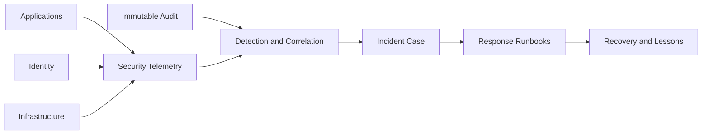

# SEC-007 — Security Audit and Incident Readiness

## Executive Summary

Phoenix must be able to detect, investigate, contain, eradicate, recover from, and learn from security incidents. Security telemetry supports detection; audit evidence supports accountability; runbooks support action. These are related but distinct systems.

## Audit Event Requirements

Material security audit records should include:

- audit event identifier;
- occurrence and recording timestamps;
- actor type and identifier;
- authenticated session or workload identity;
- action and target;
- result and reason code;
- source context, region, device, network, or service;
- correlation and causation identifiers;
- policy and model version where relevant;
- safe before/after diff or integrity hash;
- approval, case, and incident references;
- data classification and retention class.

Secrets and unnecessary content must not be logged.

## Events Requiring Security Audit

- authentication success, failure, recovery, factor change, and session revocation;
- privilege grant, elevation, use, review, and removal;
- administrator access to sensitive data;
- wallet, payout, refund, ledger correction, and provider override;
- moderation override and high-impact enforcement;
- secret or key lifecycle actions;
- security-policy changes;
- bulk data export or deletion;
- emergency or break-glass access;
- AI tool execution with material user or platform impact.

## Detection Architecture

## Incident Lifecycle

1. **Prepare:** owners, severity model, tooling, access, runbooks, communication.
2. **Detect:** alerts, user reports, provider notifications, anomaly analysis.
3. **Triage:** validate signal, classify impact, preserve evidence.
4. **Contain:** revoke, isolate, disable, rate-limit, or block.
5. **Eradicate:** remove attacker persistence and vulnerable paths.
6. **Recover:** restore safely, reconcile data, monitor recurrence.
7. **Communicate:** internal, user, provider, regulator, or public communication as required.
8. **Learn:** root cause, control gaps, corrective actions, deadlines, validation.

## Severity Model

| Severity | Example | Response expectation |
|---|---|---|
| SEV-1 | Active privileged compromise, mass data exposure, systemic financial theft | Immediate incident command and executive/security escalation |
| SEV-2 | Significant account takeover campaign, contained restricted-data exposure | Urgent coordinated response |
| SEV-3 | Limited incident with manageable impact | Prompt team response and tracked remediation |
| SEV-4 | Suspicious event or low-impact control failure | Normal investigation workflow |

Exact timing targets are defined operationally after staffing and support capabilities are known.

## Evidence Preservation

- Synchronize trusted time sources.
- Preserve relevant logs, audit records, configurations, artifacts, and access history.
- Control evidence access.
- Record collection method and integrity.
- Avoid altering compromised systems before necessary evidence is captured.
- Follow applicable legal and privacy constraints.

## Security Monitoring Principles

- Alert on behavior and outcomes, not only static indicators.
- Tune for actionable precision.
- Correlate identity, service, data, economy, and infrastructure signals.
- Monitor control failures and disabled telemetry.
- Test alert paths through exercises.
- Treat absence of expected events as a signal.

## Incident Runbooks

Initial runbooks should cover:

- credential or secret leak;
- account takeover campaign;
- administrator compromise;
- signing-key compromise;
- provider webhook or payment fraud;
- private-data exposure;
- malicious or vulnerable dependency;
- DDoS and resource exhaustion;
- AI prompt injection or tool abuse;
- audit-pipeline failure.

## AI Security Operations

AI may assist clustering, summarization, anomaly ranking, and investigation. Human incident command remains accountable. Sensitive evidence must be minimized before model use, and model-generated conclusions must be verified.

## Anti-Patterns

- One undifferentiated log stream used as audit, telemetry, and ledger.
- Alerts without owners or runbooks.
- Collecting everything indefinitely.
- Treating user reports as lower-quality evidence by default.
- Deleting or modifying evidence during response.
- Restoring service without credential rotation or root-cause containment.
- Closing incidents without corrective-action verification.

## Operational Considerations

Readiness requires on-call ownership, contact trees, secure communication, provider escalation, access to critical systems, tested backups, forensic support, and periodic tabletop exercises.

## Implementation Notes

Before launch, define the minimum incident process, severity vocabulary, evidence sources, emergency access, communication templates, and runbooks for the selected MVP capabilities.

## Future Evolution

Later maturity should include automated containment with bounded authority, threat hunting, purple-team exercises, external penetration testing, bug bounty governance, and measurable detection/recovery objectives.

## Architectural Integrity Check

- Can Phoenix identify who performed a material action?
- Are audit and telemetry distinct and correlated?
- Can credentials and sessions be revoked quickly?
- Are runbooks mapped to the threat model?
- Are recovery and lessons verified, not merely documented?

## References

- DPL-017 Audit Strategy
- ARC-009 Failure Isolation
- ARC-010 Reference Architecture
- SEC-002 Threat Model
