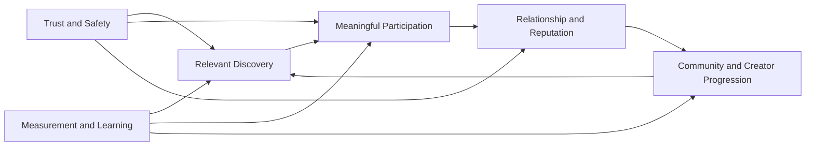

# PRD-001 — Product Vision and Value Proposition

## Executive Summary

Phoenix is a global social platform for meaningful, real-time human connection. It combines conversation, live voice, communities, creator participation, trusted social identity, and governed digital value in one coherent experience.

The product does not compete by maximizing noise, addiction, or feature count. It competes by making connection feel alive, safe, expressive, and worthy of return.

## Vision

> Phoenix enables people to find belonging, express themselves, build trusted relationships, and create value together across language, geography, and culture.

## Product Thesis

Social products become durable when they create repeated value across four layers:

1. **Discovery:** people find relevant persons, rooms, conversations, or communities.
2. **Presence:** people experience real-time participation and social energy.
3. **Trust:** people understand who and what is safe, credible, and accountable.
4. **Progression:** relationships, reputation, creator identity, and value deepen over time.

Phoenix must make these layers reinforce each other without allowing growth pressure to override safety, privacy, or fairness.

## Primary Value Propositions

| Audience | Value |
|---|---|
| New participant | Find welcoming spaces and relevant people without overwhelming complexity |
| Returning participant | Continue relationships, conversations, and communities with confidence |
| Host or creator | Build an audience, run live experiences, and earn value through trusted tools |
| Community leader | Create culture, norms, and continuity within a governed space |
| Safety operator | Detect, review, explain, and correct harmful behavior with accountable tools |
| Platform operator | Evolve a measurable, reliable, secure ecosystem with clear ownership |

## Product Differentiation

Phoenix aims to differentiate through:

- emotionally resonant live presence;
- safety-aware discovery;
- trust signals that are useful but not manipulative;
- coherent creator and community progression;
- global-ready language and cultural design;
- AI assistance that supports people rather than covertly controlling them;
- economic features grounded in ledger integrity and transparent rules;
- architecture that supports evolution without sacrificing user continuity.

## Product Principles

1. **Belonging before virality.**
2. **Human agency before algorithmic convenience.**
3. **Trust before monetization scale.**
4. **Coherence before breadth.**
5. **Progressive complexity instead of immediate overload.**
6. **Safety and privacy are part of the experience.**
7. **Creators deserve transparent value and predictable rules.**
8. **Every material product decision must be measurable and reversible.**

## Non-Goals for the Initial Product

The initial product is not intended to:

- replicate every feature of large social networks;
- launch a complete marketplace or financial ecosystem;
- maximize anonymous reach without trust controls;
- automate final moderation or financial decisions through AI;
- support unrestricted third-party extensions;
- serve every user segment equally from day one;
- optimize only for time spent or raw engagement.

## Value Loop

## Decision Matrix

| Decision | Preferred direction | Reject when |
|---|---|---|
| Add new capability | Strengthens the core loop | Creates isolated complexity without measurable user value |
| Increase reach | Preserve relevance and safety | Depends on opaque amplification or weak abuse controls |
| Add monetization | Aligns value among user, creator, and platform | Encourages exploitation, deception, or ledger ambiguity |
| Use AI | Improves comprehension, safety, creation, or support | Removes agency, hides material decisions, or accesses excessive data |
| Enter a market | Product, operations, safety, and compliance are ready | Only growth demand exists without support readiness |
| Increase personalization | Explainable purpose and controllable experience | Requires invasive data or unreviewable manipulation |

## AI Context

AI may assist translation, discovery, creation, accessibility, support, moderation triage, and safety analysis. It must be visible where materially relevant, bounded by user and policy controls, evaluated for quality and harm, and prevented from making unreviewable high-impact decisions.

## Security and Safety Considerations

Every high-growth surface is also an abuse surface. Discovery, messaging, live voice, gifting, account recovery, and moderation require risk analysis before launch.

## Operational Considerations

Product promises must match actual staffing, moderation coverage, incident readiness, creator support, payment operations, and regional capability.

## Implementation Notes

The first implementation plan should translate this vision into a narrow end-to-end loop: trusted onboarding, relevant discovery, safe participation in live or conversational spaces, relationship continuation, and measurable return value.

## Future Evolution

Future releases may add richer creator economics, community governance, multi-format content, verified organizations, advanced accessibility, broader AI tools, and ecosystem APIs after foundational evidence exists.

## Architectural Integrity Check

- Does the product strengthen discovery, presence, trust, or progression?
- Is the value understandable to users?
- Can the feature be owned by a bounded context?
- Are safety, privacy, and economic effects explicit?
- Can success and harm both be measured?

## References

- ARC-001 Architecture Vision
- ARC-010 Reference Architecture
- SEC-001 Security Vision and Principles
- PEF-001 Engineering Principles
