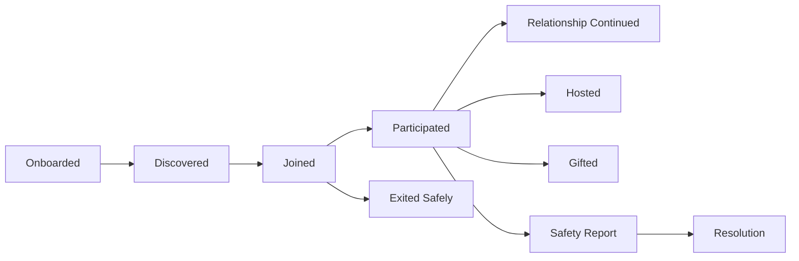

# PRD-003 — Core User Journeys

## Executive Summary

Phoenix prioritizes complete user journeys over disconnected feature delivery. Each journey crosses product, architecture, data, security, safety, analytics, and operations. A journey is not complete merely because the screen works.

## Journey 1 — Trusted Onboarding

### User outcome

A new user creates or accesses an account, understands Phoenix, establishes essential preferences, and reaches a relevant first experience without unnecessary friction.

### Essential stages

1. choose authentication method;
2. verify or establish account identity;
3. accept essential terms and privacy choices;
4. set language, accessibility, and basic profile;
5. establish safety and communication defaults;
6. select interests or initial discovery signals;
7. reach a first meaningful recommendation;
8. understand account and recovery controls.

### Critical constraints

- resist account enumeration, automation, fraud, and recovery abuse;
- minimize required personal data;
- support region and language differences;
- avoid deceptive consent;
- provide recovery and session safety;
- measure activation without forcing excessive disclosure.

## Journey 2 — Discover and Evaluate a Space

### User outcome

A user finds a person, conversation, room, or community that appears relevant and safe enough to enter.

### Required information

- title, topic, language, and format;
- host or community identity;
- social context and relationship signals;
- current participation state;
- safety, privacy, and recording status where relevant;
- why the item was recommended;
- controls to hide, report, or adjust recommendation.

## Journey 3 — Join and Participate

### User outcome

The user enters, understands the social state, participates at an appropriate level, and can exit safely.

### Required capabilities

- clear join state;
- microphone/speaker or messaging controls;
- role and permission visibility;
- moderation and reporting;
- blocking or muting;
- connection-quality feedback;
- accessible interaction;
- graceful exit and recovery from failure.

## Journey 4 — Continue a Relationship

### User outcome

A meaningful live or conversational interaction can become a trusted ongoing relationship.

### Possible progression

- follow or connect;
- continue via message;
- join the same community;
- receive relevant future room discovery;
- manage notification and privacy boundaries;
- block or end the relationship.

## Journey 5 — Host a Live Experience

### User outcome

A host creates, configures, operates, moderates, and closes a live room with clear feedback.

### Required capabilities

- create topic and audience rules;
- define visibility and access;
- assign co-host or moderator authority;
- manage speakers and participants;
- respond to disruption;
- understand connection and room state;
- end or transfer safely;
- review post-room outcomes.

## Journey 6 — Send a Gift or Value Signal

### User outcome

A user intentionally sends value, understands cost and result, and receives authoritative confirmation.

### Critical controls

- transparent price and balance;
- strong confirmation for risk-appropriate actions;
- idempotency;
- authoritative ledger;
- provider verification;
- recipient and platform rules;
- fraud detection;
- receipts, dispute, and reconciliation.

## Journey 7 — Report Harm and Receive Resolution

### User outcome

A person reports harm with minimal burden, receives acknowledgment, and can understand the outcome or appeal where appropriate.

### Required capabilities

- accessible reporting from relevant context;
- evidence preservation;
- category and free-text options;
- emergency guidance where relevant;
- status and outcome communication;
- privacy and retaliation protection;
- appeal and correction;
- operator audit.

## Cross-Journey State Model

## Journey Quality Dimensions

| Dimension | Question |
|---|---|
| Value | Did the user make meaningful progress? |
| Comprehension | Did the user understand state, consequence, and control? |
| Safety | Could harm be prevented, escaped, reported, and resolved? |
| Reliability | Did the journey survive expected failure? |
| Accessibility | Could diverse users complete it? |
| Privacy | Was only necessary data collected and exposed? |
| Trust | Was the outcome explainable and authoritative? |
| Continuity | Could the user continue or recover later? |

## Acceptance Structure

Every journey must define:

- entry conditions;
- happy path;
- alternative paths;
- abuse paths;
- failure and recovery;
- accessibility requirements;
- data and security requirements;
- events and metrics;
- operational owner;
- release and rollback criteria.

## AI Context

AI may improve translation, relevance, support, safety triage, summarization, and creation. The journey must remain understandable when AI is unavailable or wrong, and high-impact actions require deterministic controls or human review.

## Anti-Patterns

- Shipping screens without end-to-end ownership.
- Measuring only completion and ignoring harm.
- Hiding failure or uncertainty.
- Forcing users to remain in unsafe interaction.
- Treating reports as dead-end forms.
- Allowing gifts before ledger and fraud controls are authoritative.
- Optimizing onboarding only for speed.

## Operational Considerations

Journeys require customer support, safety operations, incident response, payment reconciliation, analytics, localization, and accessibility ownership.

## Implementation Notes

The MVP should implement a coherent subset of Journeys 1–5 and a minimal safe report flow. Journey 6 should launch only if economy controls are production-ready.

## Future Evolution

Later releases may include community creation, creator progression, richer media, subscriptions, organizations, and advanced cross-language interaction.

## Architectural Integrity Check

- Is the journey complete across contexts?
- Are authority and state visible?
- Are failure and abuse paths designed?
- Can the journey be measured responsibly?
- Is operational support real, not assumed?

## References

- ARC-002 Bounded Contexts
- ARC-010 Reference Architecture
- SEC-003 Identity and Authentication
- SEC-004 Authorization
