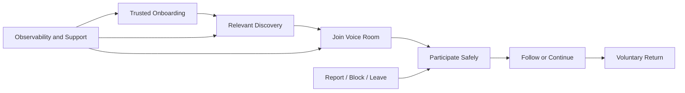

# IMP-001 — Implementation Strategy

## Executive Summary

Phoenix implementation follows a foundation-led, evidence-driven strategy. The goal is not to produce the maximum amount of code quickly. The goal is to produce a coherent system whose first executable slices preserve the ratified product, architecture, security, data, and operational decisions.

## Strategic Principles

1. Deliver end-to-end value through vertical slices.
2. Keep the first architecture modular and operable before distributing it.
3. Preserve bounded-context ownership in code and data.
4. Treat security, quality, observability, and rollback as implementation work.
5. Use contracts to integrate contexts.
6. Build only the platform capabilities required by active slices.
7. Prefer reversible decisions in uncertain areas.
8. Automate repeatable controls early.
9. Require evidence before scale.
10. Continuously reconcile implementation with documentation.

## Initial Delivery Shape

Phoenix should begin as a **modular service-oriented system with explicit bounded-context modules**, deployed in a limited number of independently operable units.

The first implementation should avoid premature microservice fragmentation while preserving extraction boundaries through:

- explicit module ownership;
- separate schemas or controlled persistence boundaries;
- contract-based APIs and events;
- no direct cross-context table access;
- isolated tests;
- versioned migrations;
- independent operational metrics.

## First Executable Product Loop

## Delivery Horizons

| Horizon | Objective |
|---|---|
| H0 Foundation Enablement | Repositories, standards, CI, environments, identity skeleton, observability |
| H1 First Safe Loop | Onboarding, discovery, room join, participation, exit, follow, report |
| H2 Quality and Continuity | Messaging, notifications, host tooling, stronger moderation, reliability |
| H3 Conditional Value | AI translation, creator progression, gifts/economy after gates |
| H4 Scale and Ecosystem | Multi-region, advanced discovery, broader APIs, richer communities |

## Decision Matrix

| Decision | Default |
|---|---|
| Monolith vs microservices | Modular deployment units first |
| Shared library vs service | Library for stable technical concerns; service for owned business capability |
| Sync vs async | Sync for immediate user outcome, async for propagation and derived work |
| Build vs buy | Buy commodity infrastructure; build differentiated product capability |
| Platform first vs feature first | Thin platform supporting a complete slice |
| Global launch vs controlled market | Controlled cohort and market readiness |
| AI in first loop | Only where bounded, optional, measurable, and safely degradable |

## Anti-Patterns

- Creating many services before stable ownership exists.
- Building a generic platform with no immediate product slice.
- Letting UI deadlines bypass domain invariants.
- Treating documentation drift as harmless.
- Postponing observability, audit, or rollback.
- Coupling release success to code merge.
- Starting economy features before ledger and operational readiness.
- Choosing technology because it is fashionable rather than justified.

## Quality and Review Model

Every implementation increment is reviewed across:

- product outcome;
- architecture boundaries;
- data ownership and contracts;
- security and abuse;
- reliability and operability;
- accessibility and localization;
- test evidence;
- rollout and rollback;
- documentation synchronization.

## Implementation Notes

The first implementation release should create a minimal repository topology, executable skeleton, CI pipeline, local development path, test harness, observability baseline, and one narrow onboarding-to-room slice.

## Future Evolution

Service extraction, multi-region distribution, specialized data stores, and advanced platform layers must follow measured load, team ownership, operational need, and clear boundaries.

## Architectural Integrity Check

- Does each implementation step preserve bounded contexts?
- Is user value delivered end to end?
- Are security and rollback implemented, not promised?
- Is infrastructure proportional to current evidence?
- Are documents and code reconciled continuously?

## References

- ARC-010 Reference Architecture
- PRD-004 MVP Scope
- PRD-008 Release Criteria
- SEC-001 Security Principles
