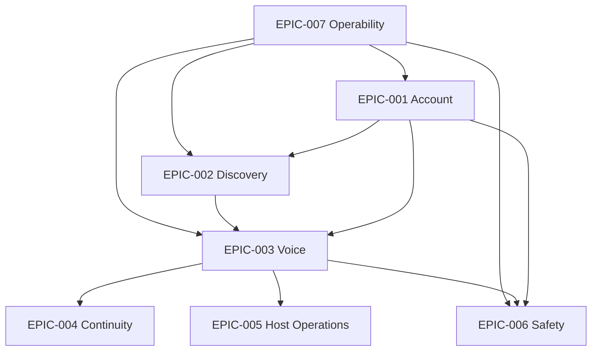

# IMP-003 — Delivery Epics and Workstreams

## Executive Summary

Phoenix work is organized into outcome-oriented epics and enabling workstreams. Epics complete user and operator value. Workstreams supply reusable capabilities required by those epics.

## Epic Model

Each epic records:

- epic ID;
- user and operator outcome;
- primary segment;
- owning product and engineering leads;
- bounded contexts;
- dependencies;
- threat and abuse cases;
- data contracts;
- acceptance and guardrail metrics;
- rollout plan;
- operational owner;
- completion evidence.

## Initial Epics

### EPIC-001 — Trusted Account Entry

**Outcome:** A user can create, access, recover, and secure an account.

Includes:
- authentication;
- sessions;
- profile basics;
- language and privacy;
- recovery;
- audit;
- support path.

### EPIC-002 — Relevant Discovery

**Outcome:** A user can find a relevant room or host with understandable trust context.

Includes:
- interest/language signals;
- curated discovery;
- room metadata;
- recommendation reasons;
- hide/block/report;
- event instrumentation.

### EPIC-003 — Safe Voice Participation

**Outcome:** A user can join, listen, speak when authorized, leave, reconnect, and recover safely.

Includes:
- room lifecycle;
- participant roles;
- audio session integration;
- moderation controls;
- connection state;
- observability;
- accessibility.

### EPIC-004 — Relationship Continuity

**Outcome:** A meaningful interaction can become a durable connection.

Includes:
- follow/connect;
- notifications;
- return discovery;
- basic messaging only when safety gates are ready;
- privacy controls.

### EPIC-005 — Host and Moderator Operations

**Outcome:** A host can create and manage a quality room.

Includes:
- create/configure room;
- assign roles;
- manage speakers;
- remove/mute;
- end/transfer room;
- post-room quality feedback;
- incident support.

### EPIC-006 — User Safety and Case Resolution

**Outcome:** A user can block, report, receive acknowledgment, and obtain a governed resolution.

Includes:
- contextual reporting;
- evidence references;
- case lifecycle;
- enforcement;
- notification;
- appeal;
- operator audit.

### EPIC-007 — Platform Operability

**Outcome:** Teams can safely deploy, observe, support, and recover the platform.

Includes:
- CI/CD;
- environments;
- logs/metrics/traces;
- audit;
- feature flags;
- incident response;
- backups;
- runbooks.

## Enabling Workstreams

| Workstream | Purpose |
|---|---|
| Identity and Security | Authentication, authorization, secrets, audit |
| Data and Contracts | Schemas, migrations, events, consistency, data quality |
| Realtime and Media | Voice transport, room state, quality monitoring |
| Trust and Safety | Reports, cases, moderation, abuse controls |
| Product Platform | Feature flags, experimentation, configuration |
| Observability and Reliability | SLOs, telemetry, alerts, failure testing |
| Client Foundations | Navigation, state, networking, accessibility, localization |
| Developer Experience | Local setup, test harness, generators, CI feedback |

## Epic Dependency View

## Priority

- P0: EPIC-001, EPIC-002, EPIC-003, minimum EPIC-006, EPIC-007.
- P1: EPIC-004, EPIC-005 expansion.
- Conditional: messaging depth, AI translation, gifts/economy.

## Anti-Patterns

- Infrastructure work with no linked epic.
- Epics defined as technical component names.
- Large epics with no demonstrable intermediate outcome.
- User-facing epic without operator and safety work.
- Separate security epic that lets other epics ignore security.
- Declaring completion without production evidence.

## Implementation Notes

Epics should be decomposed into slices small enough to demonstrate value and control. Workstream tasks are pulled by slices and remain traceable.

## Architectural Integrity Check

- Does each epic complete user or operator value?
- Are cross-cutting needs embedded?
- Are dependencies explicit?
- Is scope small enough to validate?
- Can completion be demonstrated with evidence?

## References

- PRD-003 Core Journeys
- PRD-005 Capability Model
- ARC-004 Capability Map
