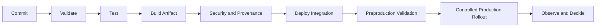

# IMP-009 — CI/CD and Release Governance

## Executive Summary

Phoenix CI/CD produces attributable, tested, signed or verifiable artifacts and promotes them through controlled environments. The same artifact is promoted; it is not rebuilt differently per environment.

## Pipeline Stages

## Pull Request Controls

- required review;
- code-owner review for sensitive paths;
- green automated checks;
- architecture boundary checks;
- migration review;
- contract compatibility;
- security scan;
- linked work item and acceptance;
- documentation update where needed.

## Artifact Requirements

Every artifact records:

- source commit;
- version;
- build identity;
- dependencies;
- checksums;
- test results;
- provenance metadata;
- configuration compatibility;
- migration requirements.

## Deployment Strategy

Use progressive deployment appropriate to risk:

- development integration;
- staging;
- internal or test cohort;
- canary or small percentage;
- controlled expansion;
- full rollout.

High-risk changes may use shadowing, dual reads, or dark launch before user exposure.

## Migration Governance

- expand-migrate-contract;
- backward-compatible deploy order;
- rehearsal in staging;
- backup or recovery;
- monitoring;
- no destructive schema change in one step;
- explicit rollback limits;
- data reconciliation.

## Release Approval

Approval is risk-weighted and includes:

- product owner;
- engineering owner;
- security/safety review where applicable;
- operational owner;
- data or migration owner;
- release commander for material rollout.

## Emergency Changes

Emergency changes still require:

- named incident or risk;
- minimal scope;
- attributable approval;
- automated checks where possible;
- monitoring;
- follow-up review;
- permanent fix and documentation.

## Supply Chain Security

- pinned or governed dependencies;
- trusted build runners;
- minimal pipeline permissions;
- protected secrets;
- artifact integrity;
- dependency and image scanning;
- provenance;
- revocation and rebuild capability.

## Anti-Patterns

- Manual artifact copying.
- Rebuilding per environment.
- Shared administrator deployment credentials.
- Unreviewed pipeline changes.
- Production deployment from developer laptop.
- Irreversible migrations bundled casually.
- Green pipeline treated as sufficient release approval.
- Emergency process becoming normal process.

## Operational Considerations

Pipeline failure, artifact compromise, deployment rollback, and secret exposure require runbooks and ownership.

## Implementation Notes

The initial pipeline should be simple but complete: validate, test, build, scan, publish, deploy to development, and support manual controlled promotion.

## Future Evolution

Add automated policy gates, signed attestations, progressive delivery automation, ephemeral environments, and continuous verification.

## Architectural Integrity Check

- Is the artifact attributable and immutable?
- Is promotion controlled?
- Are migrations compatible?
- Are credentials least-privileged?
- Can a compromised artifact be revoked?

## References

- PRD-008 Release Criteria
- SEC-005 Secrets and Keys
- SEC-007 Incident Readiness
